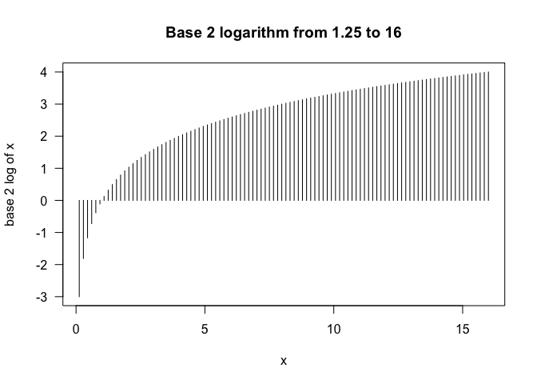
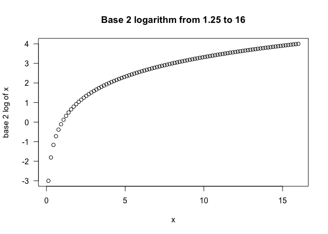
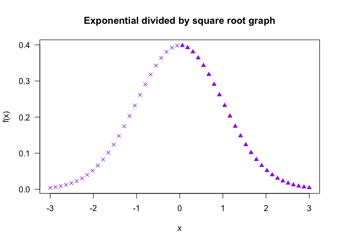
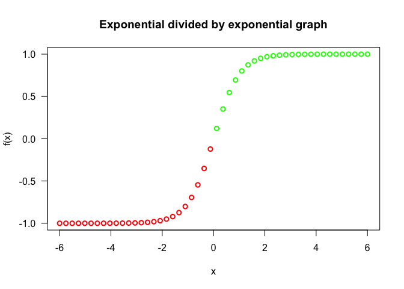

SIT114: Task 2.1P
================
Lyndon Purcell

**Note to the reader:** Text with a **bold** emphasis symbolises
functions or parameters. Text with an *italics* emphasis refers to
arguments passed to parameters or other user-defined values, such as
variable names.

This is a document demonstrating how graphs can be customized through
the use of various parameters.

## Graph 1

The first graph is a base-2 logarithm graph for *x* ∈ \[0.125,16\]. As
such, the function applied to *x* within this range is:

## 
log<sub>2</sub>*x*

We will plot this graph, and the ones that follow, by first constructing
a vector for the values of *x* using the **seq** function and passing it
the appropriate arguments. In this case, the minimum value of *0.125*,
the maximum value of *16* and the length of the returned vector,
selected to be *100*.

``` r
x <- seq(0.125, 16, length.out=100)
```

This vector is then passed the first argument to the **plot** function.
The second argument passed is the function to be applied to the *x*
values, which is log<sub>2</sub>*x*. The code chunk below shows how this
is implemented.

While this is sufficient for plotting the value of *x* and *f*(*x*), the
graph can be made more instructive by passing some additional arguments.
The following code use the argument *‘h’* for the **type** parameter in
order to produce histogram-like vertical lines. A title for the graph as
well as labels for the *x* and *y* axis are the strings passed to the
*main*, *xlab* and *ylab* parameters, respectively. The value of *1* is
passed to the **las** parameter to rotate the numbers on the *y* axis so
they are vertically aligned. All other parameters are left as default.

``` r
plot(x, log(x, base=2), type='h', main="Base 2 logarithm from 1.25 to 16", 
     xlab="x", ylab="base 2 log of x", las=1)
```

<!-- -->

A graph of this style is useful when plotting the function provided, as
log<sub>2</sub>*x* for numbers less than 1 produces values of less than
zero. This type of plot makes this more clear than other alternatives.

To illustrate, here is the exact some plot, only this time using the
default type parameter. If you were to glance at this graph quickly (as
most people do), then it wouldn’t necessarily be apparent that some of
the *y*-values are negative – even though the *y*-axis labels state
this. The idea is to make the insights of the graph as transparent as
possible.

Less obvious graph implementation:

``` r
plot(x, log(x, base=2), main="Base 2 logarithm from 1.25 to 16", 
     xlab="x", ylab="base 2 log of x", las=1)
```

<!-- -->

## Graph 2

The second graph is again constructed in a similar way, using a vector
of *x* values and simply named *x*. This time the range of values is for
*x* ∈ \[−3,3\]. The function applied to *x* is also much more elaborate.
In mathematical notation, this graph is plotted using the formula:

## 
$$\\frac{e^{\\frac{-x^2}{2}}}{\\sqrt{2\\pi}}$$

This is implemented in code by again using the **seq** function to
create the vector within the appropriate range, and passing that as the
first argument to **plot**. The second argument is the formula above;
which, using r code, requires the **exp** and **sqrt** functions. The
former exponentiates *e* (approximately 2.71828) to the value of the
expression passed to it. The latter returns the square root of the
argument passed.

This provides the *x* and *y* values for the plot, but again it can be
enhanced with some further arguments. The code demonstrates the use of
the **pch** parameter, which is used to determine the plotting character
(symbol). The argument passed to this parameter is a Boolean expression,
which asks: *If the values of *x* is less than 0, return 4. Otherwise
return 17*. This has the effect of making the negative values a cross
symbol, and all others a solid upwards-pointing triangle. The argument
*‘purple’* is also passed to the **col** parameter to change the graph’s
colour. All other parameters have either been described already or left
as default.

Altogether, the code implementation is as follows:

``` r
x <- seq(-3, 3, length.out=50)
plot(x, exp(-(x^2)/2)/sqrt(2*pi), main="Exponential divided by square root graph", 
     pch=ifelse(x < 0, 4, 17), col='purple', las=1, xlab="x", ylab="f(x)")
```

<!-- -->

## Graph 3

The third and final graph is constructed in the same way once more, only
with the requisite function.

In mathematical notation, this graph is plotting
*f*(*x*), *x* ∈ \[−6,6\] where *f* is:

## 
$$\\frac{e^x-e^{-x}} {e^x+e^{-x}}$$

As discussed for Plot 1, we want the key insights of our graphs to be
quickly interpreted. Another way of representing negative values that
are easily recognized is with colour. It has become convention for
negative values to be red and positive values to be green. The following
graph uses a boolean expression for the value of x, returning a red
marker if the value is less than zero, otherwise green.

To display this for values ranging from -6 to 6, we use the following
code:

``` r
x <- seq(-6, 6, length.out=50)
plot(x, (exp(x)-exp(-x))/(exp(x)+exp(-x)), 
     main="Exponential divided by exponential graph", col=ifelse(x < 0, "red", "green"), 
     lwd=2, las=1, xlab="x", ylab="f(x)")
```

<!-- -->
