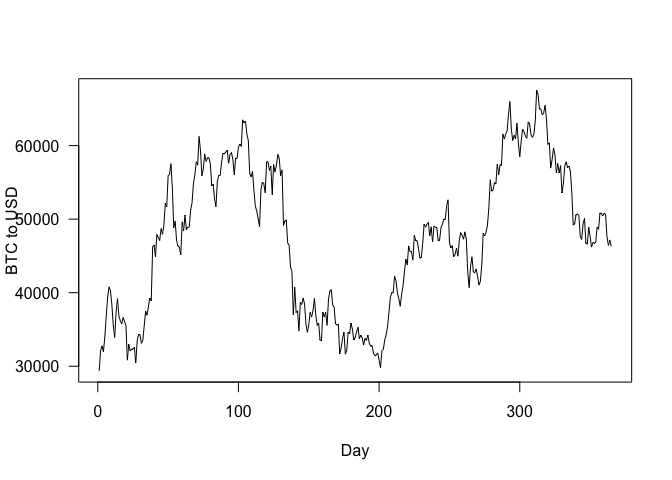
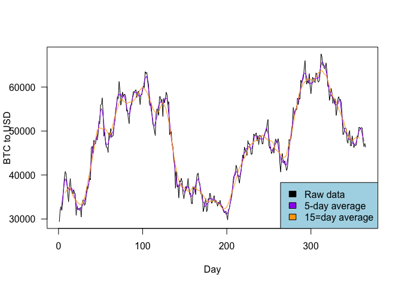

SIT114: Task 2.1P
================
Lyndon Purcell

**Note to the reader:** Text with a **bold** emphasis symbolises
functions or parameters. Text with an *italics* emphasis refers to
arguments passed to parameters or other user-defined values, such as
variable names.

This is a document analyzing time-series data of Bitcoin (BTC) to United
States Dollar (USD) exchange rates. The first code chunk, immediately
below, reads in the data using the **scan** function and assigns it to
the variable named *exchange_data*. This is then plotted as a line
graph, using the **plot** function and passing the argument *‘l’* to the
**type** parameter.

``` r
exchange_data <- scan("/Users/LJPurcell/Desktop/Deakin/SIT114/Data/btcusd_close_2021.csv")
plot(exchange_data, type='l', xlab='Day', ylab='BTC to USD', las=1)
```

<!-- --> In order to
extract a better signal from the “noisy” data, a multi-day average of
the exchange rate can also be plotted on the same graph. This can be
done using the **ma** (moving-average smoothing) function. As this is
not a built-in R function, accessing it requires loading the
**forecast** package. The following code chunk shows how this done,
using the **library** function and passing the string argument
*“forecast”*.

``` r
library("forecast")
```

Once this has been done, the **ma** function can used by simply passing
the data to be smoothed along with the number of instances that you wish
the average to account for.

The following code chunk demonstrates this by creating two
moving-averages of different length. In each case the *exchange_data*
variable is first passed in, followed by the number of data points to
consider. The argument *5* is used for the first instance, and the
result is assigned to the *average_5day* variable. The argument *15* is
used in the second instance and assigned to the *average_15day*
variable.

``` r
average_5day <- ma(exchange_data, 5)
average_15day <- ma(exchange_data, 15)
```

The orginal data and the two smoothed averages can then all be plotted
on the same graph. The orginal data is plotted in the exact same way as
above. The additional lines can be added by subsequently calling the
**lines** function, passing the smoothed averages and then
differentiating the lines (such as via colour).

The following code chunk demonstrates this, plotting the 5-day moving
average in purple, and the 15-day average in orange. The last function
call to **legend** helps consumers of the graph understand the meaning
behind the various lines. The legend below is customised using arguments
such as *“bottomright”* for legend placement; a vector of names passed
to the **legend** parameter; a vector of colours passed to **fill**,
which creates a coloured box (rather than a line) that corresponds with
the names in the **legend** parameter vector; finally, the **bg**
parameter is used to colour the background, which is light blue in this
instance.

``` r
plot(exchange_data, type='l', xlab='Day', ylab='BTC to USD', las=1)
lines(average_5day, col='purple')
lines(average_15day, col='orange')
legend("bottomright", legend=c("Raw data", "5-day average", "15=day average"), 
       fill=c("black", "purple", "orange"), bg='lightblue')
```

<!-- -->

The above plot illustrates the different consequences of viewing the
exchange data through moving averages of different lengths. If someone
was hoping to make profits more quickly (and accepted the accompanying
level of risk) then the raw data, or moving averages using a smaller
number of instances, would be preferred. Any profit, based on the rapid
movements of price, could be capitaliised on. Alternatively, if someone
was looking to make longer term investments, then they should be more
concerned with moving averages using a higher number of days/instances.
This will better reflect the long term trends of the asset without
worrying about losses on any particular day or small time-period.
