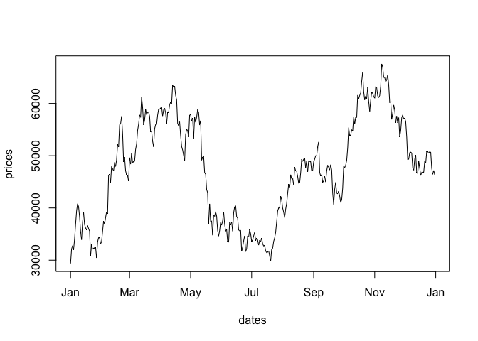
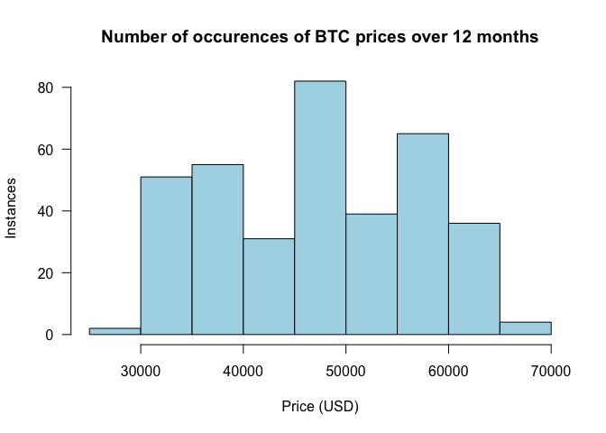
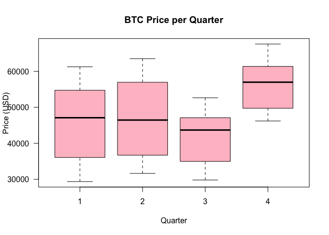

SIT114: Task 2.2C - Time Series Splitting
================
Lyndon Purcell

**Note to the reader:** Text with a **bold** emphasis symbolises
functions or parameters. Text with an *italics* emphasis refers to
arguments passed to parameters or other user-defined values, such as
variable names.

------------------------------------------------------------------------

This document continues the analysis of BTC to USD conversion rates,
this time with the addition of a second data set containing date values.

The following code chunk first reads in the price of BTC using the
**scan** function. This is stored in the *prices* variable. The second
line of code reads in the second data set, which contains the associated
dates of the prices. Once more **scan** is used initially, however the
result is then immediately passed to the **as.Date** function, which
converts the values into date objects. These are then stored in the
*dates* variable.

To visualize the data we use the **plot** function, which we are
familiar with at this point.

``` r
prices <- scan("/Users/LJPurcell/Desktop/Deakin/SIT114/Data/btcusd_close_2021.csv")
dates <- as.Date(scan("/Users/LJPurcell/Desktop/Deakin/SIT114/Data/btcusd_date_2021.csv", what=character()))
plot(dates, prices, type='line')
```

<!-- -->

We can use some simple R functions to derive some further information
from this data. We could use the **min** and **max** functions on the
price data instantly to find the smallest and highest BTC to USD
exchange rates. However, by instead using the the **which.min** and
**which.max** functions, and binding that value to a variable, we can
index into both *prices* and *dates* to find the relevant information
with ease.

The following code chunk demonstrates this by first getting the index of
the minimum value in *prices*, then obtaining what the minimum value is
by using it to index into *prices*. What date it occurred on is found by
using the same index for *dates*.

``` r
min_index <- which.min(prices)
prices[min_index]
```

    ## [1] 29374.15

``` r
dates[min_index]
```

    ## [1] "2021-01-01"

And now the same with the maximum values:

``` r
max_index <- which.max(prices)
prices[max_index]
```

    ## [1] 67566.83

``` r
dates[max_index]
```

    ## [1] "2021-11-08"

As such, the minimum price was $29,374.15 US and occurred on January
1st, 2021. The maximum price was $67,566.83 US and occurred on November
8th, 2021.

For further analysis, we will compute the minimum, maximum and average
exchange rate of all quarters in 2021. To do so, first we will create
some descriptive variables to make the operations easier to perform – as
well as more intuitive for the reader.

Let’s first create a variable called *q1_start* to, unsurprisingly,
represent the start of of the first quarter. This can be achieved by
passing the appropriate date (January 1st) to **as.Date** in a
yyyy-mm-dd format. This is the first line of code. The second line of
code repeats this process, only this time with the end date of quarter
one (March 31st).

Next, we will create a logical vector determining whether a particular
date is in Q1, 2021. We can do this by creating a Boolean expression
that computes whether a date is **TRUE** or **FALSE** for the following:
*greater than or equal to January 1st, 2021* and *less than or equal to
March 31st, 2021*. The result is a vector, which we will simply call
*q1*.

``` r
q1_start <- as.Date("2021-01-01")
q1_end <- as.Date("2021-03-31") 
q1 <- dates >= q1_start & dates <= q1_end
```

To confirm this is correct, however, we will do some quick checks. We
should have a vector with 365 elements (the number of days in the year)
and 90 **TRUE** elements (the total number of days in January, February
and March). We can use the **length** and **sum** functions for this.

``` r
length(q1)
```

    ## [1] 365

``` r
sum(q1) # TRUE elements have the numeric value of 1, while FALSE is 0
```

    ## [1] 90

Additionally, to check that our logical values are aligned correctly
with the dates, we can use the **head** and **tail** functions to print
out the first and last instances, respectively.

``` r
head(dates[q1], 3)
```

    ## [1] "2021-01-01" "2021-01-02" "2021-01-03"

``` r
tail(dates[q1], 3)
```

    ## [1] "2021-03-29" "2021-03-30" "2021-03-31"

As you can see we get the first days of January and the last days of
March. Perfect. We will now use the same process to create logical
vectors for the remaining quarters.

Quarter 2:

``` r
q2_start <- as.Date("2021-04-01")
q2_end <- as.Date("2021-06-30") 
q2 <- dates >= q2_start & dates <= q2_end
```

Quarter 3:

``` r
q3_start <- as.Date("2021-07-01")
q3_end <- as.Date("2021-09-30") 
q3 <- dates >= q3_start & dates <= q3_end
```

Quarter 4:

``` r
q4_start <- as.Date("2021-10-01")
q4_end <- as.Date("2021-12-31") 
q4 <- dates >= q4_start & dates <= q4_end
```

Now we can easily access and localize the data in particular quarters.
Here is the minimum, maximum, and average exchange rate for each of the
quarters.

Quarter 1:

``` r
q1_min <- min(prices[q1])
q1_max <- max(prices[q1])
q1_mean <- mean(prices[q1])
q1_info <- c("Q1 Minimum"=q1_min, "Q1 Maximum"=q1_max, "Q1 Mean"=q1_mean)
print(q1_info)
```

    ## Q1 Minimum Q1 Maximum    Q1 Mean 
    ##   29374.15   61243.09   45323.78

Quarter 2:

``` r
q2_min <- min(prices[q2])
q2_max <- max(prices[q2])
q2_mean <- mean(prices[q2])
q2_info <- c("Q2 Minimum"=q2_min, "Q2 Maximum"=q2_max, "Q2 Mean"=q2_mean)
print(q2_info)
```

    ## Q2 Minimum Q2 Maximum    Q2 Mean 
    ##   31637.78   63503.46   46497.78

Quarter 3:

``` r
q3_min <- min(prices[q3])
q3_max <- max(prices[q3])
q3_mean <- mean(prices[q3])
q3_info <- c("Q3 Minimum"=q3_min, "Q3 Maximum"=q3_max, "Q3 Mean"=q3_mean)
print(q3_info)
```

    ## Q3 Minimum Q3 Maximum    Q3 Mean 
    ##   29807.35   52633.54   41988.77

Quarter 4:

``` r
q4_min <- min(prices[q4])
q4_max <- max(prices[q4])
q4_mean <- mean(prices[q4])
q4_info <- c("Q4 Minimum"=q4_min, "Q4 Maximum"=q4_max, "Q4 Mean"=q4_mean)
print(q4_info)
```

    ## Q4 Minimum Q4 Maximum    Q4 Mean 
    ##   46202.14   67566.83   55881.25

Next we will draw a histogram of the price data. We can do this by using
the **hist** function and passing in our price data.

``` r
hist(prices, main="Number of occurences of BTC prices over 12 months", 
     xlab="Price (USD)", ylab="Instances", las=1, col='lightblue')
```

<!-- -->

The striking feature of this graph is that it is multi-modal. It shows
the largest number of closings had a BTC price between 4,500 and 5,000
USD. However, there were also a significant number of closings at
\~3,500 and \~5,750 USD. The data does not follow a normal, bell-curve
distribution though. There is a detectable absence of closings only
slightly above or below the primary modal price.

The insight we could draw from this is that BTC prices generally fall
into three categories. The first is the most common price, \~4,750 USD.
The second is the price during a “bear” market, \~3,500 USD. The third
is the price during a “bull” market, \~5,750 USD.

Next we will look at differences in performance between quarters. We
will do so using a box (and whisker) plot as the basis of our analysis.
Using this style of plot we can learn about each quarter’s minimum,
maximum, and median values, as well as how widely dispersed the values
in the interquartile range were.

To visualize this plot we can simply store the price data of each
quarter in a list, and then pass that list to the **boxplot** function.

``` r
all_quarters <- list(prices[q1], prices[q2], prices[q3], prices[q4])
boxplot(all_quarters, main="BTC Price per Quarter", col='pink',
        xlab="Quarter", ylab="Price (USD)", las=1)
```

<!-- -->

The intuitive takeaway from the plot would be that Q3 was the poorest
performing of all the quarters. We can see that Q3 had the lowest
median, maximum, and an interquartile range that was tight and low.
Alternatively, Q4 performed extremely well, with a tight and high
interquartile range, as well as the highest maximum, median, and minimum
(of which was still higher than approximately 70% of the values
throughout Q3).

The first two quarters were relatively stable in comparison, falling in
the middle, with slightly better performance in Q2 compared to Q1.
