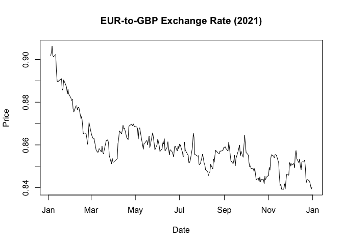
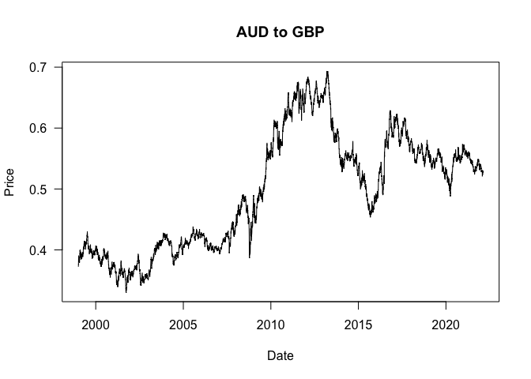

SIT114: Task 3.1P
================
Lyndon Purcell

------------------------------------------------------------------------

**Note to the reader:** Text displayed as `inline code` represents
functions, logical values or indices. Text with a **bold** emphasis
symbolizes parameters for functions. Text written in *italics* refers to
arguments passed to parameters or variable names.

------------------------------------------------------------------------

This document demonstrates data filtering and aggregation through
computations on matrices.

## Section 1: Reading in the data

The data is read into the workspace using the function `read.csv`. This
then passes the data object straight to the `as.matrix` function, to
ensure the data is in the correct format to work with. This is then
stored in the *exchange_data* variable. We can confirm this worked by
calling the `class` function on *exchange_data*, as well displaying the
first few rows by calling the `head` function.

``` r
exchange_data <- as.matrix(
  read.csv(("/Users/LJPurcell/Desktop/Deakin/SIT114/Data/eurofxref-numeric-20220213.csv")))
class(exchange_data)
```

    ## [1] "matrix" "array"

``` r
head(exchange_data, 3)
```

    ##       Date    USD    JPY    BGN CYP    CZK    DKK EEK     GBP    HUF LTL LVL
    ## [1,] 19034 1.1417 132.24 1.9558  NA 24.405 7.4400  NA 0.83958 353.38  NA  NA
    ## [2,] 19033 1.1439 132.42 1.9558  NA 24.350 7.4404  NA 0.84248 354.02  NA  NA
    ## [3,] 19032 1.1435 132.04 1.9558  NA 24.288 7.4437  NA 0.84255 352.94  NA  NA
    ##      MTL    PLN ROL    RON     SEK SIT SKK    CHF   ISK     NOK    HRK     RUB
    ## [1,]  NA 4.5204  NA 4.9458 10.5530  NA  NA 1.0557 141.8 10.0732 7.5312 85.8550
    ## [2,]  NA 4.4921  NA 4.9451 10.5275  NA  NA 1.0571 141.8 10.0693 7.5275 85.0187
    ## [3,]  NA 4.5135  NA 4.9449 10.4075  NA  NA 1.0555 142.2 10.0585 7.5285 85.5289
    ##      TRL     TRY    AUD    BRL    CAD    CNY    HKD      IDR    ILS     INR
    ## [1,]  NA 15.4066 1.5927 5.9263 1.4498 7.2564 8.9054 16339.46 3.6958 85.8535
    ## [2,]  NA 15.4838 1.5894 5.9668 1.4498 7.2722 8.9142 16390.21 3.6796 85.9373
    ## [3,]  NA 15.5510 1.5933 6.0198 1.4514 7.2759 8.9106 16390.99 3.6817 85.5765
    ##          KRW     MXN    MYR    NZD    PHP    SGD    THB     ZAR
    ## [1,] 1363.68 23.3183 4.7832 1.7085 58.482 1.5339 37.282 17.2736
    ## [2,] 1367.52 23.3584 4.7855 1.7076 58.583 1.5345 37.331 17.3078
    ## [3,] 1365.72 23.4719 4.7853 1.7107 58.603 1.5349 37.404 17.5281

## Section 2: Visualising the data

Now we have some data to work with, let’s visualize it. We shall plot
the exchange rate for EUR-to-GBP for the year 2021. In order to do this,
we will first isolate the dates we are concerned with. This can be
achieved by creating a *dates* variable, using the first column of our
data set. We can select all rows, for the first column, with the
indexing syntax `[,1]`.

If we perform this inside the `as.Date` function, and pass
*“1970-01-01”* to the **origin** parameter, we can have all our dates
formatted in a much more comprehensible fashion. The result will then be
bound to the *dates* variable. Next, we will create a logical vector
using our *dates* variable, asking if a value is in the year 2021.

We will confirm this has all worked by calling the functions `head` and
`tail` on the *dates* variable, while indexing into it using the logical
vector for dates in the year 2021.

``` r
dates <- as.Date(exchange_data[,1], origin="1970-01-01")
year_2021 <- dates >= "2021-01-01" & dates <= "2021-12-31"
head(dates[year_2021], 3)
```

    ## [1] "2021-12-31" "2021-12-30" "2021-12-29"

``` r
tail(dates[year_2021], 3)
```

    ## [1] "2021-01-06" "2021-01-05" "2021-01-04"

The output from `head` is as we would expect, we get the last three days
of the year. However, `tail` seems to be a mistake. The first value we
get is the 4th of January. This is not a mistake, however. If we dig
into our data a little more, we find that there are no values listed
that correspond to the first three days of the year. This is because New
Years Day the market was closed, and this fell on a Friday, meaning the
next two days were Saturday and Sunday. As such, the first day of the
year that the market opened was the 4th, as our data reliably showed.

Although our dates read backwards, as in `head` returned the most recent
rather than the earliest dates, this does not matter for plotting
purposes. All that matters is that the correct dates (the vector
supplying the *x*-axis coordinates) align with the exchange rate
(supplying the *y*-coordinate). It does not matter if the plot is “drawn
forwards” or “drawn backwards”, it will be the same. To simplify, if we
were to plot two coordinates, say (1,1) and (2,2), the plot would be
identical irrespective of which point got drawn first.

Passing the relevant variables to `plot` yields a function call that
looks as follows:

``` r
plot(dates[year_2021], exchange_data[year_2021, "GBP"], 
     main="EUR-to-GBP Exchange Rate (2021)", ylab="Price", xlab="Date", type='l')
```

<!-- -->

The output is a plot showing an downards trend in the EUR-to-GBP
exchange rates.

## Section 3: Summary statistics for all currencies

In this section we will compute the lowest, highest, and average
exchange rate for the EUR to each currency in the data set for the year
2021. We already have a way of isolating the relevant year, and we can
make this process even easier again by creating a custom function that
takes one argument (i.e., all the data for a single currency) and
calculates the three statistics we are interested in; the minimum,
maximum and mean. The below function does just that and returns the
results.

``` r
min_mean_max <- function(x) {
  c(min=min(x), mean=mean(x), max=max(x))
}
```

Now that we have our custom function, `min_mean_max`, we need an
appropriate matrix of data that we can apply it to. The matrix we need
is a submatrix of *exchange_data*. We require a matrix which is only
rows that fall within 2021, and only columns of currencies. We want to
exclude the *Date* column, as calculating the summary statistics for
this would be meaningless. We achieve this by indexing into
*exchange_data* with the logical vector *year_2021* as the first (row)
argument, and *-1* as the second (column) argument. This returns all
rows that are in the year 2021, and all the columns except the first
(which is *Date*). This matrix is then bound to the variable *all_2021*.

Next, we make use of the `apply` function. The first, second, and third
argument passed are the variable *all_2021*, the number *2*, and our
custom function `min_mean_max`, respectively. The number 2 in this
instance is an argument that instructs the function to operate in a
column-wise manner. Altogether, the `apply` function with these
arguments is being asked to: apply to *all_2021*, column-wise, the
function `min_mean_max`. These results are then stored in the variable
*results*.

``` r
all_2021 <- exchange_data[year_2021,-1] 
results <- apply(all_2021, 2, min_mean_max)
```

Time to display our results! But, before we do so, we should consider
how they will appear. Currently, we have a 3x41 matrix; three statistics
for each of the forty-one countries. This will produce output that is
very short and wide, which is not the ideal format. Instead, we would do
better to list the countries as rows and make the matrix only three
statistics wide.

We can perform this operation using the `t` function, where “t” stands
for “transpose” – a common operation in linear algebra where a matrix of
*n*-rows and *p*-columns is flipped along its diagonal so that it
becomes a matrix of *p*-rows and *n*-columns, whilst preserving the
order of both rows and columns.

The following code chunk does this, binding the result of the
tranposition to a variable called *results_transposed*. A caption for
the table is then bound to the variable *table_caption*. These variables
are both then passed to the `kable` function in the `knitr` package,
along with a vector containing the column names, to display the results.

``` r
results_transposed <- t(results)
table_caption <- "Summary statistics for exchange rate of EUR to different currencies"
knitr::kable(results_transposed, caption=table_caption, 
             col.names=c("Minimum", "Mean", "Maximum"))
```

|     |     Minimum |         Mean |     Maximum |
|:----|------------:|-------------:|------------:|
| USD |     1.12060 | 1.182740e+00 |     1.23380 |
| JPY |   125.18000 | 1.298767e+02 |   134.05000 |
| BGN |     1.95580 | 1.955800e+00 |     1.95580 |
| CYP |          NA |           NA |          NA |
| CZK |    24.85800 | 2.564049e+01 |    26.41700 |
| DKK |     7.43590 | 7.437028e+00 |     7.44130 |
| EEK |          NA |           NA |          NA |
| GBP |     0.83923 | 8.596036e-01 |     0.90635 |
| HUF |   345.82000 | 3.585161e+02 |   370.91000 |
| LTL |          NA |           NA |          NA |
| LVL |          NA |           NA |          NA |
| MTL |          NA |           NA |          NA |
| PLN |     4.45200 | 4.565179e+00 |     4.71190 |
| ROL |          NA |           NA |          NA |
| RON |     4.87050 | 4.921479e+00 |     4.95100 |
| SEK |     9.89730 | 1.014646e+01 |    10.33150 |
| SIT |          NA |           NA |          NA |
| SKK |          NA |           NA |          NA |
| CHF |     1.03310 | 1.081147e+00 |     1.11140 |
| ISK |   145.90000 | 1.501545e+02 |   157.20000 |
| NOK |     9.68280 | 1.016333e+01 |    10.61700 |
| HRK |     7.47600 | 7.528410e+00 |     7.59130 |
| RUB |    80.64170 | 8.715272e+01 |    92.38420 |
| TRL |          NA |           NA |          NA |
| TRY |     8.39750 | 1.051237e+01 |    20.04340 |
| AUD |     1.53170 | 1.574942e+00 |     1.63730 |
| BRL |     5.86350 | 6.377890e+00 |     6.95530 |
| CAD |     1.42060 | 1.482569e+00 |     1.56510 |
| CNY |     7.16000 | 7.628231e+00 |     7.96530 |
| HKD |     8.73720 | 9.193176e+00 |     9.56590 |
| IDR | 16018.25000 | 1.692072e+04 | 17589.83000 |
| ILS |     3.46580 | 3.820775e+00 |     4.00860 |
| INR |    83.43900 | 8.743916e+01 |    90.59550 |
| KRW |  1323.16000 | 1.354057e+03 |  1393.32000 |
| MXN |    23.14380 | 2.398524e+01 |    25.57590 |
| MYR |     4.71520 | 4.901511e+00 |     5.08090 |
| NZD |     1.60950 | 1.672379e+00 |     1.71080 |
| PHP |    56.25600 | 5.829907e+01 |    60.00500 |
| SGD |     1.52790 | 1.589100e+00 |     1.62650 |
| THB |    36.06000 | 3.783676e+01 |    39.49000 |
| ZAR |    16.39230 | 1.747655e+01 |    18.80790 |

Summary statistics for exchange rate of EUR to different currencies

The above table shows a number of countries whose summary statistics
were computed as `NA`, representing data that is “Not Available” or
missing. When calculating the minimum, mean, or maximum for a given list
of values, if any of the values are missing then the result will be
`NA`.

Data is missing from countries such as SIT, SKK, CYP, LVL and MTL
because they switched to using the EUR as their currency.

## Section 4: Plotting AUD-to-GBP exchange rates

Next, we will plot a line-graph depicting the exchange rate from
AUD-to-GBP. Although our data does not contain this directly, we can
calculate it, as a we know the EUR-to-AUD and EUR-to-GBP exchange rates.

We will perform this task in two steps. First, we need to use the
provided exchange rates (EUR-to-AUD and EUR-to-GBP) to calculate the
reverse exchange rates (AUD-to-EUR and GBP-to-EUR). This will allow us
compare the value of AUD and GBP using EUR as a common medium. To
calculate the reverse we divide 1 by the exchange rate.

We will isolate the AUD data by indexing into our *exchange_data* matrix
with `[,"AUD"]` – all rows for the *AUD* column – and then use each
element to perform division on the value 1. This gives us a new vector
of AUD to EUR exchange rates. We will do the same again for GBP, using
`[,"GBP"]`. The results will be bound to *AUD_to_EUR* and *GBP_to_EUR*,
respectively.

Next, we simply divide one vector by the other. As we are concerned with
AUD-to-GBP exchange rates, we want to perform AUD divided by GBP. This
is completed element-wise, and the resulting vector is bound to the
variable *AUD_to_GBP*.

Finally, the price over time is plotted by passing *dates* as the
*x*-variable and *AUD_to_GBP* as the *y*-variable. Other parameters for
`plot` are set accordingly.

``` r
AUD_to_EUR <- 1 / exchange_data[,"AUD"]
GBP_to_EUR <- 1 / exchange_data[,"GBP"]

AUD_to_GBP <- AUD_to_EUR / GBP_to_EUR

plot(dates, AUD_to_GBP, type='l', main="AUD to GBP",
     xlab="Date", ylab="Price", las=1)
```

<!-- -->

The output demonstrates the fluctuations of the AUD-to-GBP exchange rate
over the years.

## Section 5: Mean AUD-to-GBP exchange rates for various years

As a final piece of analysis, we will compute the average AUD-to-GBP
exchange rates for the years of 2019, 2020, and 2021 (separately). Given
the data we have isolated and functionality we have created thus far,
this should not be difficult.

First, we will create two more logical vectors for indexing into the
appropriate year. We already have *year_2021* for accessing dates in
2021, and we will do the same for the years 2019 and 2020 (again, using
a Boolean expression with the requisite dates).

Then, all we have to do to compute the mean AUD-to-GBP exchange rate for
the three years is index into *AUD_to_GBP* using the relevant year, and
pass that as an argument to `mean`.

``` r
year_2019 <- dates >= "2019-01-01" & dates <= "2019-12-31"
year_2020 <- dates >= "2020-01-01" & dates <= "2020-12-31"
mean_AUD_to_GBP_2019 <- mean(AUD_to_GBP[year_2019])
mean_AUD_to_GBP_2020 <- mean(AUD_to_GBP[year_2020])
mean_AUD_to_GBP_2021 <- mean(AUD_to_GBP[year_2021])
```

The results are as follows:

``` r
mean_AUD_to_GBP_2019
```

    ## [1] 0.5449098

``` r
mean_AUD_to_GBP_2020
```

    ## [1] 0.5380906

``` r
mean_AUD_to_GBP_2021
```

    ## [1] 0.5459181
