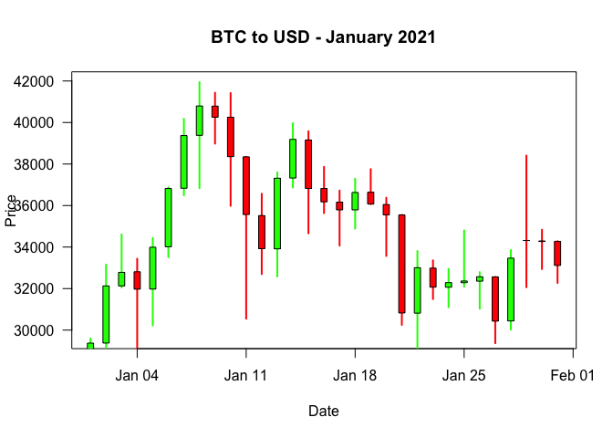

SIT114: Task 3.2D
================
Lyndon Purcell

------------------------------------------------------------------------

**Note to the reader:** Text displayed as `inline code` represents
functions and logical values. Text with a **bold** emphasis symbolizes
parameters for functions. Text written in *italics* refers to arguments
passed to parameters or variable names.

------------------------------------------------------------------------

The data set used for this task will contain information on the daily
BTC to USD exchange rates for the year 2021. Within the data, the first
row corresponds to the first day of the year, and the 365th row
corresponds to the last. In the raw data, each row contains the date, as
well as the opening, daily high, daily low, and closing price for BTC to
USD.

## Section 1 - Load the data

Reading in our data is a familiar operation. We will extract it from the
CSV format and import it into our workspace in the form of a matrix. We
will do so using the `read.csv` and `as.matrix` functions.

All rows, and columns 1 to 4 will be read in; these are the columns
which include the price information. The column containing dates will be
excluded as we can reference any particular date by simply accessing the
appropriate row. The resultant matrix will then be bound to the variable
*exchange_data*.

We will then call the `head` function to confirm that our data has been
read in successfully.

``` r
exchange_data <- as.matrix(read.csv("/Users/LJPurcell/Desktop/Deakin/SIT114/Data/btcusd_ohlcv_2021.csv")[,1:4])
head(exchange_data, 3)
```

    ##          open     high      low    close
    ## [1,] 28994.01 29600.63 28803.59 29374.15
    ## [2,] 29376.46 33155.12 29091.18 32127.27
    ## [3,] 32129.41 34608.56 32052.32 32782.02

## Section 2 - Plotting the data

This section will use the data to create a candlestick plot for the
month of January 2021. This will be achieved using only the following
functions: `plot`, `points`, `lines`, and `rect`.

The candlestick plot conveys the following key pieces of information:

1.  Daily high (top wick)
2.  Difference between open and close (candlestick length)
3.  Whether close was higher than open (candlestick colour; green
    symbolizing the price went up)
4.  Daily low (bottom wick)

First, we will isolate the portion of the data that we are concerned
with. We will do this by creating a submatrix of our orginal data, using
all columns for the first thirty-one rows. These rows correspond to the
dates January 1st, 2021 through to January 31st, 2021.

Next, we will create a vector of Date-objects, for each day within
January. This can be achieved by a combination of the `as.Date` and
`seq` functions, as demonstrated in the code below.

``` r
jan_data <- exchange_data[1:31,]
jan_dates <- seq(as.Date("2021-01-01"), as.Date("2021-01-31"), by=1)
```

We now have a matrix of data for January and vector containing all the
relevant dates. Importantly, a given row *n* in the matrix contains the
data for a date which is the *n*-th item in the vector. This will make
indexing into the relevant data much easier.

To start with, we will generate a basic skeleton for our plot. We do so
by calling the `plot` function as usual, providing the relevant
information for titling and axis labels. Differently this time, however,
we will pass the argument *‘n’* to the **type** parameter. This means
that nothing will actually be plotted.

``` r
plot(jan_dates, jan_data[,2], type='n', main="BTC to USD - January 2021", 
     ylab="Price", xlab="Date", las=1)
```

Next, we will create some functions that will make plotting our graph
much more convenient.

The first function we will define determines whether a day was bullish
or bearish. The `if_went_up` function has two parameters, one for the
particular day in question, and another for the matrix which contains
the pricing information. The function then uses the `ifelse` function,
and provided parameters, to ask: *For this day, given the data, was the
opening price less than the closing price?* If so, the function returns
`TRUE`, indicating the price went up. Otherwise it returns `FALSE`.

``` r
if_went_up <- function(day, data) {
  went_up <- ifelse(data[day,"open"] < data[day,"close"], TRUE, FALSE)
}
```

The second function, `day_colour`, makes use of what `if_went_up`
returns to determine whether the candle body and wicks for that day
should be red or green. It achieves this by taking a single, logical
parameter relating to whether or not the day went up. The `ifelse`
function is used once more, only this time if the **went_up** parameter
is `TRUE` it returns the colour green, otherwise red.

``` r
day_colour <- function(went_up) {
  day_col <- ifelse(went_up == TRUE, "green", "red")
}
```

Our third function is `plot_wick` which needs four parameters. It
requires an argument for which day is to be plotted, what colour the
wick is to be, the vector of dates and the matrix of data.

The first thing this function does is use the **day** parameter to index
into the **dates** vector. It then calls the `rep` function on this
result, with the secondary argument of *2*. This date, replicated twice,
is then stored in a vector names *xs* (as in *x*<sub>1</sub> and
*x*<sub>2</sub>) which represents the *x*-coordinates for the end points
of the wick.

The function then determines the corresponding *y*-coordinates by using
the **day** parameter to index into the relevant row in the **data**
matrix. It does this twice, with one indexing into the *“high”* column,
and the other *“low”*. These high and low values (coordinates
*y*<sub>1</sub> and *y*<sub>2</sub>) for the relevant day are then
stored in a vector bound to the *ys* variable.

Using this, the *xs* and *ys* vectors can be passed as the first and
second arguments to `lines`, and it will draw a line from
(*x*<sub>1</sub>,*y*<sub>1</sub>) to (*x*<sub>2</sub>,*y*<sub>2</sub>).
These coordinates correspond to the daily high and daily low.

``` r
plot_wick <- function(day, day_col, dates, data) {
  xs <- c(rep(dates[day], 2))
  ys <- c(data[day,"high"], data[day,"low"])
  lines(xs, ys, col=day_col, lwd=2)
}
```

With the wicks now plotted, we can plot our candle bodies. We will,
again, create a custom function, this time named `plot_body` to achieve
this. Five parameters will be passed; the same four as `plot_wick`, with
the addition of **went_up**.

The operations required to plot the bodies are slightly more intensive
than plotting the wicks, as the `rect` function (in place of `lines`)
requires more direction on where it is to plot. `rect` needs four
parameters to determine where the top, bottom, left and right side of
the rectangle will be placed. Determining the left and right side
coordinates is relatively simple. Like when plotting the wicks, we can
use the **day** parameter to index into the **dates** vector. This will
be the *x*-coordinate for the centre of our rectangle. We can then
offset this by adding and subtracting a small amount to give us the
*x*-coordinates for the left and right side of our rectangle. The code
below does exactly this; it goes to the relevant day and then adds or
subtracts 0.2, providing the right and left side *x*-coordinates,
respectively.

Next, we must determine the *y*-coordinates for the top and bottom of
the rectangle. The issue, though, is that we do not know whether the
coordinates for the top of the rectangle are the day’s opening price or
the closing price. This is why **went_up** is a parameter, it solves
this problem. If **went_up** is `TRUE`, then we know that the top
*y*-coordinate is the closing price. It can then be set accordingly,
along with the closing price as the bottom *y*-coordinate.
Alternatively, this is reversed if **went_up** is `FALSE`. The relevant
assignments are made using this process, implemented with the `if`
statement.

With all this done, we can pass the relevant variables to `rect` as
parameters. The **day_col** parameter is also passed to ensure the
candle body is the same colour as its wick.

``` r
plot_body <- function(day, went_up, day_col, dates, data) {
  xl <- dates[day] - 0.2
  xr <- dates[day] + 0.2
  open <- data[day,"open"] 
  close <- data[day,"close"]
  if (went_up == TRUE) {
    yb <- open
    yt <- close
  } else {
    yb <- close
    yt <- open
  }
  rect(xleft=xl, ybottom=yb, xright=xr, ytop=yt, col=day_col)
}
```

Finally, we come to the `plot_candles` function, which encapsulates all
the previously described functionality. The function takes two
parameters, **dates** and **data**. It then uses a `for` loop and the
`length` function called on **dates** to iterate through each date,
which creates a *day* variable for indexing.

The function then passes *day* and the **data** matrix to `if_went_up`,
assigning the result to *went_up*. `day_colour` is then called, taking
in *went_up* as its only parameter and assigning the result to
*day_col*. Next, `plot_wick` is called, using the *day* iterator,
*day_col* variable, the *dates* vector and *data* matrix. Finally,
`plot_body` is called taking in these same arguments once more, as well
as the *went_up* variable.

``` r
plot_candles <- function(dates, data) {
 for (day in 1:length(dates)) {
   went_up <- if_went_up(day, data)
   day_col <- day_colour(went_up)
   plot_wick(day, day_col, dates, data)
   plot_body(day, went_up, day_col, dates, data)
 }
}
```

When called like this within the loop, the outcome is to calculate the
relevant information, and plot both a candle and wick for each day.

Altogether, the code described looks follows. The last line is the
actual call to the **plot_candles** function, which initiates the
process and resulting in the output.

``` r
plot(jan_dates, jan_data[,2], type='n', main="BTC to USD - January 2021", 
     ylab="Price", xlab="Date", las=1)

if_went_up <- function(day, data) {
  went_up <- ifelse(data[day,"open"] < data[day,"close"], TRUE, FALSE)
}

day_colour <- function(went_up) {
  day_col <- ifelse(went_up == TRUE, "green", "red")
}

plot_wick <- function(day, day_col, dates, data) {
  xs <- c(rep(dates[day], 2))
  ys <- c(data[day,"high"], data[day,"low"])
  lines(xs, ys, col=day_col, lwd=2)
}

plot_body <- function(day, went_up, day_col, dates, data) {
  xl <- dates[day] - 0.2
  xr <- dates[day] + 0.2
  open <- data[day,"open"] 
  close <- data[day,"close"]
  if (went_up == TRUE) {
    yb <- open
    yt <- close
  } else {
    yb <- close
    yt <- open
  }
  rect(xleft=xl, ybottom=yb, xright=xr, ytop=yt, col=day_col)
}

plot_candles <- function(dates, data) {
 for (day in 1:length(dates)) {
   went_up <- if_went_up(day, data)
   day_col <- day_colour(went_up)
   plot_wick(day, day_col, dates, data)
   plot_body(day, went_up, day_col, dates, data)
 }
}

plot_candles(jan_dates, jan_data)
```

<!-- -->

## Section 3 - Analysis: Up, then what?

Now that we have visualized our data, we can conduct some further
analysis to see what else it reveals. One thing we can look at is the
number of instances where there were price increases in two consecutive
days, and contrast that against the number of instances where an
increase was followed by a decrease.

Given the functions we have defined already, this is quite a simple
task. We will define another function called **what_follows_up** that
takes a single parameter, a matrix of data. Next, the function
initializes two variables to zero, *up_up* and *up_down* to keep count
of what the price does the day following a price increase.

The function then iterates through a `for` loop, creating an iterator
variable called *day*, starting from two and going through to the number
of rows in matrix. This number is determined by using the `nrow`
function. The first step in the loop is to call `if_went_up` twice. Once
passing *day*, and another passing *day*-1 (i.e., the previous day).
These results are then bound to *today_up* and *yesterday_up*,
respectively.

At this point we can use a series of simple Boolean expressions to help
us increment our counters. The first is whether *yesterday_up* is
`TRUE`, if so, then today’s result is one we concerned with. If not, we
can keep on iterating through the loop. Within the `if` statement, there
is another that asks whether *today_up* is `TRUE`. If it is, then
*up_up* is incremented by one. If not, then *up_down* is incremented by
one.

Finally, the function makes use of the `print` and `paste` functions to
output the final result of *up_up* and *up_down* to the screen.

``` r
what_follows_up <- function(data) {
  up_up <- 0
  up_down <- 0
  for (day in 2:nrow(data)) 
  {
    yesterday_up <- if_went_up(day-1, data)
    today_up <- if_went_up(day, data)
    
    if (yesterday_up == TRUE)
    {
      if (today_up == TRUE) {
        up_up <- up_up + 1
      }
      else {
      up_down <- up_down + 1
      }
    }
  }
  print(paste("Up & Up:", up_up)) 
  print(paste("Up & Down:", up_down))
}

what_follows_up(exchange_data)
```

    ## [1] "Up & Up: 82"
    ## [1] "Up & Down: 101"

We can see that when called using our data, there are 82 times when the
price went up again, after having already gone up the day before.
Alternatively, there were 101 occasions where an up day was followed by
a down day.

## Section 4 - Analysis: Longest trends

Another form of analysis we could do on the financial data is
determining the longest run of consecutive bullish or bearish days;
i.e., throughout the year, what was the longest streak of closing prices
being higher than open, as well as the opposite. To answer these
questions, we will define a function called `longest_streaks` that
implements an algorithm to compute the answers.

The function definition starts by assigning values to three variables.
The value of 1 is assigned to *current_streak*, and the value of 0 is
assigned to both *longest_increasing* and *longest_decreasing*. Next,
the function iterates through a `for` loop that is set up in a very
similar way to `what_follows_up`; there’s an iterator variable called
*day*, it starts from two and goes through to the number of rows in the
matrix. The loop then calls `if_went_up` twice, determining whether the
previous day was a price increase, and the same again for current day.
These results are again bound to *today_up* and *yesterday_up*.

Next, a Boolean expression asks whether both *today_up* and
*yesterday_up* are `TRUE`. If so, the variable *current_streak* is
incremented by one. Immediately following this, another Boolean
expression that asks if *current_streak* is greater than
*longest_increasing*. If so, then the value of *current_streak* is
assigned to *longest_increasing*, and a new benchmark has been set for
longest run of bullish days. The same logic is then applied to
consecutive days of price decreases; only that *today_up* and
*yesterday_up* must equal `FALSE`, and *current_streak* must be larger
than the value of *longest_decreasing*.

If *today_up* and *yesterday_up* are neither both `TRUE`, or both
`FALSE`, then there is no ongoing streak. The current day could be the
start of a streak, though, so the value of *current_streak* is set to 1
(not 0). This then completes the loop and it iterates to the next day
and repeats the process.

Once the loop has finished, the function displays the results to the
user by calling the `print` and `paste` functions, ouputting the results
of *longest_increasing* and *longest_decreasing*.

``` r
longest_streaks <- function(data) {
  current_streak <- 1
  longest_increasing <- 0
  longest_decreasing <- 0
  
  for (day in 2:nrow(data)) 
  {
    
    yesterday_up <- if_went_up(day-1, exchange_data)
    today_up <- if_went_up(day, exchange_data)
    
    if (yesterday_up == TRUE & today_up == TRUE) {
      current_streak <- current_streak + 1
      if (current_streak > longest_increasing) {
        longest_increasing <- current_streak
      }
    } 
    else if (yesterday_up == FALSE & today_up == FALSE) {
      current_streak <- current_streak + 1
      if (current_streak > longest_decreasing) {
        longest_decreasing <- current_streak
      }
    } 
    else {
      current_streak <- 1
    }
  }
  print(paste("Longest increasing:", longest_increasing)) 
  print(paste("Longest decreasing:", longest_decreasing))
}

longest_streaks(exchange_data)
```

    ## [1] "Longest increasing: 10"
    ## [1] "Longest decreasing: 5"

## Section 5: Implications and application

The following questions are answered in relation to a machine learning
algorithm that predicts the exchange rate on the next day.

#### How would you use it to invest your money?

It would depend on the performance of the algorithm. Human history is
rife with examples of “algorithms” that predict the future (the weather,
a person’s personality or destiny, whether it will be a good harvest
etc.). The issue is not necessarily algorithm construction, but whether
the algorithm can be relied on.

If the algorithm showed promise, I would allow it to invest small
amounts of money on days when the price was predicted to go up the next
day. Importantly, though, the amount of funds the algorithm has access
to should be limited. Even if it returns good results for a long stretch
of time, caution should not waver too much. Computers are efficient and
lack common sense; if the algorithm interprets something incorrectly, or
the format of the data changes for some reason, it may make a large
amount of poor investments of huge financial consequence well before a
human can intervene. The damage can be done very quickly.

#### What could happen if the algorithm was 100% accurate but everyone in the world had access to it?

In relation to what *could* happen, I think a whole bunch of things are
possible. What *would* happen, though, I do not know. Anything ranging
from quasi-Utopia, where the global distribution of wealth was much more
even due to highly useful financial instruments/algorithms not being
massively centralized and under the control of the already wealthy. The
alternative, however, is Dystopia, where violence occurred on huge
scales in an attempt to disrupt the use of the algorithm so that one
group could could benefit by preventing other groups from cutting into
their profits.

#### Do you think it is possible to predict the prices accurately based only on past exchange rates?

It would depend on your conception of accurate; what is the criterion of
success?

Focusing on the “past” element of the question, my answer is no.
Philosophically, this is known as the “Problem of Induction”.
Observation of past events, no matter how many, are not evidence that
something is guaranteed. Only having seen one form of data does not
prove that other forms do not, or cannot, exist. The aphorism which
conveys this wisdom warns: No matter how many white swans you see, you
cannot infer the impossibility of a black swan. The past is a clue to
the future; it can, and should, constrain our expectations. But we must
be open-minded about the possibility of being surprised.

In relation to the “exchange rates” part of the question, my answer is a
little more positive. Yes, past exchange rates are probably useful for
predicting future exchange rates – again, though, considering how
accurate is accurate? Additionally, it should be considered that factors
“outside of the system” were responsible for influencing and determining
the past exchange rates. These may be things such as geopolitical
disagreements, new laws or regulations, social media trends, or
celebrity statements and endorsements. These were the causes, and the
(past) exchange rates were the effect. It is likely that predicting
future exchange rates cannot be done accurately without some
consideration for the causes of the data that has been observed, and how
they may again have influence.
