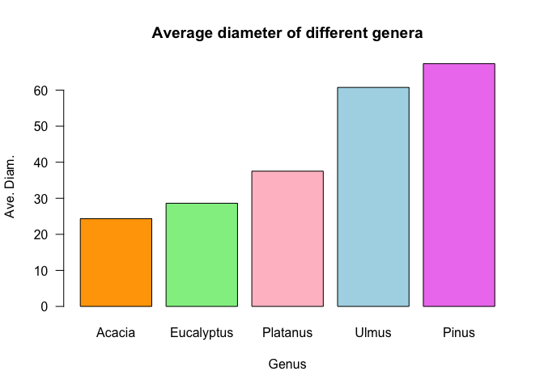

SIT114: Task 4.1P
================
Lyndon Purcell

------------------------------------------------------------------------

**Note to the reader:** Text displayed as `inline code` represents
packages, functions, logical values and indices. Text with a **bold**
emphasis symbolizes parameters for functions. Text written in *italics*
refers to arguments passed to parameters, variable names and column
names.

------------------------------------------------------------------------

This document demonstrates data-frame wrangling techniques; using base
R, as well as the functions contained within the `dplyr` and
`data.table` packages. The data set used contains information on trees
located in the city of Melbourne. A description and download of the data
can be found
[**here**](https://data.melbourne.vic.gov.au/Environment/Trees-with-species-and-dimensions-Urban-Forest-/fp38-wiyy).

## Section 1: Reading in the data

The data is read in using one of the standard R functions, `read.csv`.
The result will be bound to the variable name *tree_data*. To ensure
that this has worked we can call the `class` function on each column in
*tree_data* (using `sapply`). This will serve the purpose of testing the
data was read in successfully, as well as telling us the types of data
and how to access each column by name. We can also call `dim` to tell us
how large the dataset is.

``` r
tree_data <- read.csv("/Users/LJPurcell/Desktop/Deakin/SIT114/Data/Melbourne_tree_data.csv")
sapply(tree_data, class)
```

    ##                       CoM.ID                  Common.Name 
    ##                    "integer"                  "character" 
    ##              Scientific.Name                        Genus 
    ##                  "character"                  "character" 
    ##                       Family       Diameter.Breast.Height 
    ##                  "character"                    "integer" 
    ##                 Year.Planted                 Date.Planted 
    ##                    "integer"                  "character" 
    ##              Age.Description       Useful.Life.Expectency 
    ##                  "character"                  "character" 
    ## Useful.Life.Expectency.Value                     Precinct 
    ##                    "integer"                    "logical" 
    ##                   Located.in                   UploadDate 
    ##                  "character"                  "character" 
    ##           CoordinateLocation                     Latitude 
    ##                  "character"                    "numeric" 
    ##                    Longitude                      Easting 
    ##                    "numeric"                    "numeric" 
    ##                     Northing 
    ##                    "numeric"

``` r
dim(tree_data)
```

    ## [1] 76928    19

## Section 2: Number of trees from various species planted before or after 2003

### Method 1 - Base R

As a first analysis of our data, we shall compute how many River Red
Gums, London Planes, and Golden Wattles were planted before and after
2003. Doing so will require the *Year.Planted* and *Common.Name*
columns.

Our first step will be to create a logical vector, so that we can select
only the rows that contain the relevant names; this will help keep the
code from getting too lengthy and laborious to read. This is the
variable *common_names*. Next, rather than trying to work with a dataset
that is 76,928 rows x 19 columns, we will create a sub-data-frame.

Our new data-frame just needs to include the observations (rows) where
the *Common.Name* column is equal to one of the trees we interested in
and just one other parameter in addition to common name; the year it was
planted. As such, a vector containing the digits 2 and 7 can be passed
as the columns argument. This data-frame of reduced dimensions is bound
to the variable *sub_df*.

``` r
common_names <- ( tree_data$Common.Name == "Golden Wattle" 
                | tree_data$Common.Name == "River red gum"
                | tree_data$Common.Name == "London Plane")

# Creates sub-data-frame only including relevant trees and columns
sub_df <- tree_data[common_names, c(2, 7)]
```

Now that we have the data-frame down to only the relevant trees, we can
turn our attention to grouping it based on when the trees were planted.
This can be achieved via a simple Boolean expression: Is the year the
tree was planted greater than 2003? If so, it was planted after 2003; if
not, it was planted before. These outcomes can be represented as `TRUE`
and `FALSE`, respectively. Additionally, we can append these results to
our new, smaller data-frame by creating an additional column called
*After.2003*.

``` r
# Appends a new column to the data-frame containing logical values for each row
sub_df$After.2003 <- sub_df$Year.Planted > 2003
```

The final step, for this part of the analysis, is to aggregate the data
based on the various subcategories we are interested in. There are 3
trees of interest, with 2 year-planted subgroups for each tree, so we
need an aggregation for 6 different combinations.

One way to achieve this is the `aggregate` function. This function
allows us to divide our data up into various categories, apply a summary
function to each category, and then formats the results. As we are
interested in the number of trees within a certain subcategory, we will
pass the `length` function to the **FUN** parameter. The first argument
passed, to the parameter **x**, will be the *Common.Name* column of
*sub_df*. The second argument, passed to **by**, is a list of two
columns (*Common.Name* and *After.2003*) by which the data is to be
separated. Appropriate names for each category are also assigned.

The result of this aggregation is bound to *counts*.

``` r
# Aggregate number of common names when grouped by common name and year planted
counts = aggregate(x = sub_df$Common.Name,
                   by = list(Common.Name=sub_df$Common.Name, After.2003=sub_df$After.2003), 
                   FUN = length)
```

Finally, we can rename the third column of *counts* so that the output
to the user has more meaning. The following code chunk does just that.
The last line is the call to display the results.

``` r
# Renames third column name
colnames(counts)[3] <- "Count"
knitr::kable(counts)
```

| Common.Name   | After.2003 | Count |
|:--------------|:-----------|------:|
| Golden Wattle | FALSE      |   121 |
| London Plane  | FALSE      |  4259 |
| River red gum | FALSE      |  3756 |
| Golden Wattle | TRUE       |   703 |
| London Plane  | TRUE       |   807 |
| River red gum | TRUE       |  4385 |

This is a compact summary of the data on the relevant trees. We can
clearly see what each column and row represents, making it easier to
drawing some implications. For example, there were substantially more
London Plane trees planted prior to 2003 than there were after (at time
of writing), whereas the two other trees have had increased plantings.

### Method 2 - Dplyr package

Now that we have performed the task in base R, let’s produce the same
outcome, yet with the help of the `dplyr` package. Following that, we
will do the same again with the `data.table` package. This will give us
a solid idea of how the same tasks can be performed, and how efficient
some additional tools can be.

To start with, we will load the `dplyr` package. The benefit of `dplyr`
is that it makes the process of working with data-frames (and tibbles)
much more efficient. This is achieved not only through powerful
functions, but also the pipe operator `%>%`, which allows the result of
one computation to be passed immediately as input to the next. As such,
the code below achieves the exact same as what we have previously, yet
in a less verbose manner.

``` r
library("dplyr")

tree_data %>% 
  filter(Common.Name == "Golden Wattle" | Common.Name == "River red gum"
                    | Common.Name == "London Plane") %>% # Filters rows on column value
  select(Common.Name, Year.Planted)                  %>% # Selects only two columns
  mutate(After.2003 = Year.Planted > 2003)           %>% # Creates a new, logical column
  group_by(Common.Name, After.2003)                  %>% # Groups data by two variables
  summarise(Count = length(Common.Name))                 # Displays length of each group
```

    ## # A tibble: 6 × 3
    ## # Groups:   Common.Name [3]
    ##   Common.Name   After.2003 Count
    ##   <chr>         <lgl>      <int>
    ## 1 Golden Wattle FALSE        121
    ## 2 Golden Wattle TRUE         703
    ## 3 London Plane  FALSE       4259
    ## 4 London Plane  TRUE         807
    ## 5 River red gum FALSE       3756
    ## 6 River red gum TRUE        4385

The results match the ones generated in base R exactly, yet the process
of generating them using `dplyr` is much more streamlined.

### Method 3 - Data.table package

To expand our understanding of the problem, and resources available for
solving it, let’s now compose a solution using the `data.table` package.
Once more, we must first load the package. Then, comparable steps are
executed using `data.table` syntax and functionality.

``` r
library("data.table")

# Converts tree_data to data-table
tree_DT <- data.table(tree_data)            

# Selects rows using column values, selects a list of columns, and adds a third column
tree_DT <- tree_DT[ Common.Name == "Golden Wattle" | Common.Name == "River red gum"
                  | Common.Name == "London Plane", 
                  list(Common.Name, Year.Planted)] [, After.2003 := Year.Planted > 2003]

# Groups data by C'Name and A'2003, assigning number of observations in groups to Count
tree_DT[,.(Count=.N), by=.(Common.Name, After.2003)]
```

    ##      Common.Name After.2003 Count
    ## 1: River red gum       TRUE  4385
    ## 2: River red gum      FALSE  3756
    ## 3:  London Plane      FALSE  4259
    ## 4:  London Plane       TRUE   807
    ## 5: Golden Wattle       TRUE   703
    ## 6: Golden Wattle      FALSE   121

Again, we find the same results we achieved using base R and `dplyr`;
even if the implementation varies.

## Section 3: Average diameter of various genera

In this section, we will compute the average diameter at breast height
(separately) of trees from the following genera: Eucalyptus, Platanus,
Acacia, Ulmus, and Pinus.

To start with, we will once more isolate the observations of interest by
creating a logical vector, this time called *genus_names*. This will
then be used to reduce our *tree_data* date-frame to a more compact
version, bound to *genus_df*.

``` r
genus_names <- c( tree_data$Genus == "Eucalyptus" | tree_data$Genus == "Platanus" 
                | tree_data$Genus == "Acacia"     | tree_data$Genus ==  "Ulmus"
                | tree_data$Genus == "Pinus")

# Creates sub-data-frame only including relevant genera
genus_df <- tree_data[genus_names,]
```

Next, we will use `aggregate` once more to create subgroups of our data.
This time the continuous variable of interest, passed to the parameter
**x**, will be *Diameter.Breast.Height*. The observations will be
grouped according *Genus*, and this is passed to the **by** parameter in
the form of a list. We are interested in the average diameter, so the
function `mean` is passed to **FUN**. Finally, **na.rm** is set to
`TRUE`. The result is bound to the variable *ave_diam*.

Columns of the aggregated data are then given appropriate names of
*Genus* and *Average.Diameter* using the `colnames` function. The
aggregated data is then sorted based on this average diameter, with the
sorted data being bound to *ave_diam_sorted*. The output (generated by
`kable`) is as follows:

``` r
# Aggregate diameter, grouped by genus, and calculate the mean of each subgroup 
ave_diam <- aggregate(x = genus_df$Diameter.Breast.Height, 
                      by = list(genus_df$Genus),
                      FUN = mean, 
                      na.rm = TRUE)

#Rename columns; sort rows in ascending order; output table
colnames(ave_diam)[1:2] <- c("Genus", "Average.Diameter")
ave_diam_sorted <- ave_diam[order(ave_diam$Average.Diameter),]
knitr::kable(ave_diam_sorted)
```

|     | Genus      | Average.Diameter |
|:----|:-----------|-----------------:|
| 1   | Acacia     |         24.32927 |
| 2   | Eucalyptus |         28.61787 |
| 4   | Platanus   |         37.51601 |
| 5   | Ulmus      |         60.74568 |
| 3   | Pinus      |         67.34356 |

To convey this information more effectively, we can visualize it. A
bar-plot is perfect for this. First, we will create a vector of the
(sorted) genera names so that they can be attached to each bar. A vector
of colours is also created so make each bar distinct. `barplot` is then
called on the sorted, average-diameter data, as well as passing in the
vectors of names and colours.

``` r
# Create vector of genera names; vector of colours; output formatted bar-plot
bar_names <- ave_diam_sorted$Genus
bar_cols <- c("orange", "lightgreen", "pink", "lightblue", "violet")
barplot(ave_diam_sorted$Average.Diameter, main="Average diameter of different genera", 
        xlab="Genus", ylab="Ave. Diam.", names=bar_names, col=bar_cols, las=1)
```

<!-- -->

### Method 2 - Dplyr package

The following code once more demonstrates how to achieve the same task
using `dplyr` functionality.

``` r
tree_data %>%
  filter(Genus == "Eucalyptus" | Genus == "Platanus" | Genus == "Acacia" 
         | Genus ==  "Ulmus" | Genus == "Pinus")         %>% # Filters rows using columns
  select(Genus, Diameter.Breast.Height)                  %>% # Selects relevant columns
  group_by(Genus)                                        %>% # Groups by genus
  summarise(Ave.Diam=mean(Diameter.Breast.Height, na.rm=TRUE)) %>% # Summarizes by mean
  arrange(Ave.Diam)                                          # Orders by average diameter
```

    ## # A tibble: 5 × 2
    ##   Genus      Ave.Diam
    ##   <chr>         <dbl>
    ## 1 Acacia         24.3
    ## 2 Eucalyptus     28.6
    ## 3 Platanus       37.5
    ## 4 Ulmus          60.7
    ## 5 Pinus          67.3

We see that these results are the same as the ones using base R, but
again, the code is much more concise and easy to read.

### Method 3 - Data.table package

Finally, we will solve this problem again by making use of the
additional `data.table` functionality.

``` r
genus_DT <- data.table(tree_data)

# Selects rows using column values
genus_DT <- genus_DT[ Genus == "Eucalyptus" | Genus == "Platanus" | Genus == "Acacia"
                    | Genus == "Ulmus"      | Genus == "Pinus"]

# Changes original column name to shorter version
setnames(genus_DT, "Diameter.Breast.Height", "Diameter")

# Groups rows by genus, calculating the mean diameter; orders by new "Ave.Diam"
genus_DT <- genus_DT[,.(Ave.Diam=mean(Diameter, na.rm=TRUE)), by=Genus][order(Ave.Diam)]

genus_DT
```

    ##         Genus Ave.Diam
    ## 1:     Acacia 24.32927
    ## 2: Eucalyptus 28.61787
    ## 3:   Platanus 37.51601
    ## 4:      Ulmus 60.74568
    ## 5:      Pinus 67.34356

As expected (and somewhat hoped) we again find the values that we are
familiar with.

## Section 4: Questions

The following questions, and answers, relate to the dataset used in this
document being made freely available by The City of Melbourne and the
implications of this.

### What are the benefits of sharing such data with the general public?

Transparency, when used appropriately, can be beneficial for all
parties. In the eyes of the public, transparency can build trust in the
system and the public can have faith that the trees of Melbourne are
being well cared for in a systematic fashion. The City of Melbourne can
also receive benefits from being voluntarily transparent with data, as
transparency can increase accountability and prevent corruption or
neglect. Interesting insights are also more likely to be generated using
the data if it is made available to all.

### Are there any concerns?

Whilst data transparency seems net-positive in many situations, there
are still concerns. Open-source data could be used for hostile purposes
by rival nations or political groups. While this seems unlikely, given
the nature of the dataset in question, caution should still be
exercised. Data on trees may not seem overly sensitive to most, but that
is possibly because the intention to do harm is absent. With motivation,
an opposing group may be able to turn such data into a competitive
advantage.

### What can an AI engineer do with them?

An AI engineer can do many things, once provided data. The engineer may
find patterns that were previously unknown, adding to the body of
scientific knowledge for a topic. The engineer could also extract
information that assists operational and strategic efforts. For
instance, if the rate of tree-turnover was deemed too high, an engineer
could analyse the data and determine that more of a certain tree should
be planted, as they have a longer expected lifetime. Alternatively, if
trees were dying more rapidly in certain areas than others, an engineer
would be able to investigate this abnormality, sourcing potential
causes.
