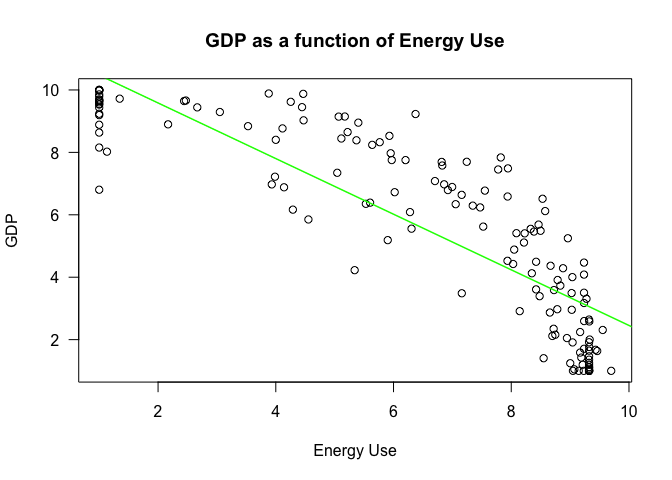
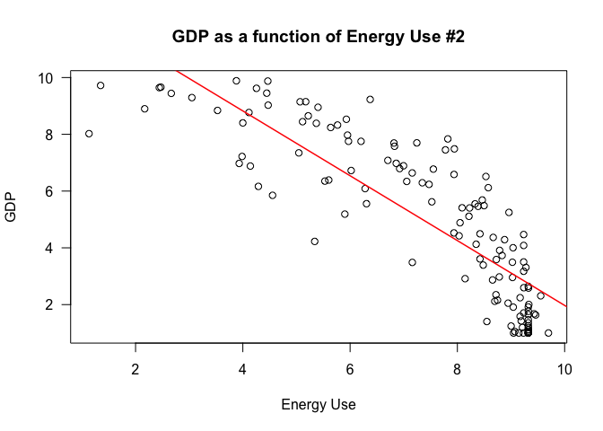

SIT114: Task 5.1P
================
Lyndon Purcell

------------------------------------------------------------------------

**Note to the reader:** Text displayed as `inline code` represents
packages, functions, logical values or indices. Text with a **bold**
emphasis symbolizes parameters for functions. Text written in *italics*
refers to arguments passed to parameters or variable names.

------------------------------------------------------------------------

This document demonstrates the use of linear regression applied to data
in the Sustainable Society Indices for the year 2016. The dataset, and
others, can be found [here](https://ssi.wi.th-koeln.de/index.html).

## Section 1: Reading in the data

We read in the data using the `read.csv` function, passing the in the
hash symbol (#) to the **comment.char** parameter, indicating that the
dataset contains values (character strings) which aren’t part of the
data and are denoted by this symbol. We will then call the function
`colnames` to clarify our data was read in successfully and to see what
variables we have to work with.

``` r
SSI <- read.csv("/Users/LJPurcell/Desktop/Deakin/SIT114/Data/ssi_2016_indicators.csv", comment.char = '#')
colnames(SSI)
```

    ##  [1] "Country"                 "SufficientFood"         
    ##  [3] "SufficientWater"         "SafeSanitation"         
    ##  [5] "Education"               "HealthyLife"            
    ##  [7] "GenderEquality"          "IncomeDistribution"     
    ##  [9] "PopulationGrowth"        "GoodGovernance"         
    ## [11] "Biodiversity"            "RenewableWaterResources"
    ## [13] "Consumption"             "EnergyUse"              
    ## [15] "EnergySavings"           "GreenhouseGases"        
    ## [17] "RenewableEnergy"         "OrganicFarming"         
    ## [19] "GenuineSavings"          "GDP"                    
    ## [21] "Employment"              "PublicDebt"

We see that there are a range of variables; twenty-two in total.

## Section 2: Generating a linear model

First, as we will be creating a “Simple Linear Model”, we only need two
variables – one independent (our *X*, being *EnergyUse*) and one
dependent (our *Y*, being *GDP*). To make model generation easier, we
can first isolate the data of relevance and store it in a new, reduced
data-frame. Doing so simply requires extracting the two columns of
interest from the first dataset and combining them into a data-frame.
The first line of code below achieves this, naming the new data-frame
*model_df*.

Next, we will calculate a linear model of global domestic product (GDP)
as a function of energy use. We will create our model with the `lm`
function and passing in the parameters using the format *Y* \~ *X*. The
below code generates this model and calls it *f*. The last line then
prints out the model’s coefficients.

``` r
model_df <- data.frame(X=SSI$EnergyUse, Y=SSI$GDP)
f <- lm(Y ~ X, model_df)
print(f$coefficients)
```

    ## (Intercept)           X 
    ##   11.369046   -0.891456

Looking at these coefficients, our model, therefore, has been defined as
*G**D**P* = 11.37 − 0.89*E**n**e**r**g**y**U**s**e*. The interpretation
of this is that each country has a a baseline GDP – when energy usage is
zero. Then, as energy use increases, the GDP of the country tends to
decline from there, proportional to the amount of energy used. In short,
the more energy a country uses, the lower its GDP.

However, it is important to remember that our rudimentary analysis
cannot determine the direction of causality (among other things). At
this point it is unclear whether higher energy use leads to lower GDP –
directly or indirectly – or whether lower GDP leads to higher energy
use.

## Section 3: Plotting the data

To plot the data we can call the `plot` function. As we are examining
“GDP as a function of energy use,” *EnergyUse* will be represented on
the *x*-axis, with *GDP* on the *y*-axis. We will also overlay the line
of best fit, as defined by our model *f*, over the top of this plot
using the `abline` function.

``` r
plot(x=model_df$X, y=model_df$Y, main="GDP as a function of Energy Use",
     xlab="Energy Use", ylab="GDP", las=1)
abline(f, col="green", lwd=1.5)
```

<!-- -->

Interestingly, once we plot the data, we see that there are a grouping
of identical, low *EnergyUse* values, where the resultant *GDP* value
differs. As we are trying to assess the relationship between energy use
and GDP only, we may be best to remove these values. The following code
does just this, generates a model based on this cleaned data, and then
prints out the new models coefficients as well as the difference between
the coefficients for the new model and the old.

``` r
# Removing low GDP values influenced by something other than Energy Use
model_df2 <- data.frame(X=SSI$EnergyUse[SSI$EnergyUse>1], Y=SSI$GDP[SSI$EnergyUse>1])

#Creates new model and displays its coefficients
f2 <- lm(Y ~ X, model_df2)
print(f2$coefficients)
```

    ## (Intercept)           X 
    ##   13.392892   -1.142152

``` r
# Difference between the two models' coefficients
print(f2$coefficients - f$coefficients)
```

    ## (Intercept)           X 
    ##   2.0238456  -0.2506964

Here we see that the new model has an intercept value that is \~2 units
higher, as well as a more severe, negative relationship between changes
in energy use and GDP. This is demonstrated if we plot the cleaned data
and the updated line of best fit.

``` r
plot(x=model_df2$X, y=model_df2$Y, main="GDP as a function of Energy Use #2", 
     xlab="Energy Use", ylab="GDP", las=1)
abline(f2, col="red", lwd=1.5)
```

<!-- -->

## Section 4: Calculating *R*<sup>2</sup>

Now that we have a model, we can turn our attention towards it, making
it the object of analysis. One method we can apply is calculating
*R*<sup>2</sup>, which is measure of “goodness of fit,” a statistical
summary of how well our model fits the data.

*R*<sup>2</sup> is also known as the coefficient of determination.
Calculating it is equivalent to asking, “How much of the change in *Y*
is explained by a change in *X*?”. To answer this, we need to calculate
two different values.

The first thing we need to calculate is the total amount of variation in
the dependent variable. To do so, we need the some measure of central
tendency for our *Y* values, so we can simply call the `mean` function,
and pass in the *GDP* column vector. Then we can use this to calculate
the total difference between all the observed-values and the
average-value. We compute this by summing the squared-difference, for
each observation, from the mean. The result of this will be bound to the
variable *TSS*, for total summed-squares.

``` r
mean_Y <- mean(model_df$Y)
TSS <- sum((model_df$Y - mean_Y)^2)
TSS
```

    ## [1] 1458.395

Now that we know how GDP varies, we next need to determine how much of
this variation is NOT captured by our model (as we can use this to
determine how much IS captured by it). This requires calculating the sum
of the squared-residuals; how far away the predicted value is from the
observed one – as opposed to how far away the average value is from the
observed one. Fortunately, our model object, *f*, already contains the
residuals, so calculating the sum of their squares is rather trivial.
The result is bound to the variable *SSR*.

``` r
SSR <- sum(f$residuals^2)
SSR
```

    ## [1] 381.5459

With these two values now calculated, we can determine *R*<sup>2</sup>
by inserting them into the following equation:

#### 
*R*<sup>2</sup> = 1 − *S**S**R*/*T**S**S*

Implemented in code:

``` r
R_squared <- 1 - (SSR / TSS)
R_squared
```

    ## [1] 0.7383795

To further examine the effectiveness of our model *f*, let us now
compare its *R*<sup>2</sup> value to the same value of *f2* – the model
fitted to the cleaned data.

Calculating the coefficient of determination for our second model
follows the same process. In code this looks as follows:

``` r
mean_Y2 <- mean(model_df2$Y)
TSS2 <- sum((model_df2$Y - mean_Y2)^2)  # Variability of cleaned Y
SSR2 <- sum(f2$residuals^2)             # Variability of cleaned Y not captured
R_squared2 <- 1 - (SSR2 / TSS2)         # Variability of cleaned Y captured
R_squared2
```

    ## [1] 0.7166721

Interestingly, we find that our original model had the higher score and,
thus, fit the data more effectively.

A higher *R*<sup>2</sup> value indicates that changes in the output
variable are more strongly determined by changes in the input variable.
Algebraically, this is achieved by lessening the fraction that is
subtracted from 1; by either having a smaller amount of residual error
left after the model is applied, or larger amount of total variation
that requires capturing.

We can best understand this formula by taking it to extremes. By having
an SSR value of zero – as our model was perfect – nothing would be
subtracted from 1, and hence, 100% of variability of *Y* would be
determined by *X*. Alternatively, if SSR was equal to TSS, then 1 - 1/1
would equal 0. This would mean that the model predicted no better than
by simply taking the average value of *Y*.

In our case, the value of 0.738 for *f* is a moderately-high
*R*<sup>2</sup> value; as is the slightly lower score of 0.717 for *f2*.
This indicates that the models will, or should, perform decently (but
not perfectly) when given new input values. In other words, both models
approximates reality, but do not model it in its entirety.

Additionally, this exercise demonstrates that there is no “single source
of truth” when it comes to data analysis, but a variety of best-practice
principles that should be applied when possible. For example, plotting
is important as it can help you see the pattern of the data, possibly
detecting outliers and some values to be removed. However, cleaning the
data – in this case – ultimately produced a model that did not predict
the data as effectively.

## Section 5: Predicting GDP for new EnergyUse values

Now that we have a model that seems to fit observed reality somewhat, we
can have some – but not complete – confidence about making predictions
based on new instances.

The following code creates a list of three new values, named *X_new*,
and then passes that list to the `predict` function, as well as the
model *f*.

``` r
# Making predictions using our defined model by passing in new input values
X_new <- list(X=c(2.5, 5, 7.5))
predict(f, X_new)
```

    ##        1        2        3 
    ## 9.140406 6.911766 4.683126

The results are as we would expect; the lower the *EnergyUse* input the
higher the predicted *GDP*, and vice versa.
