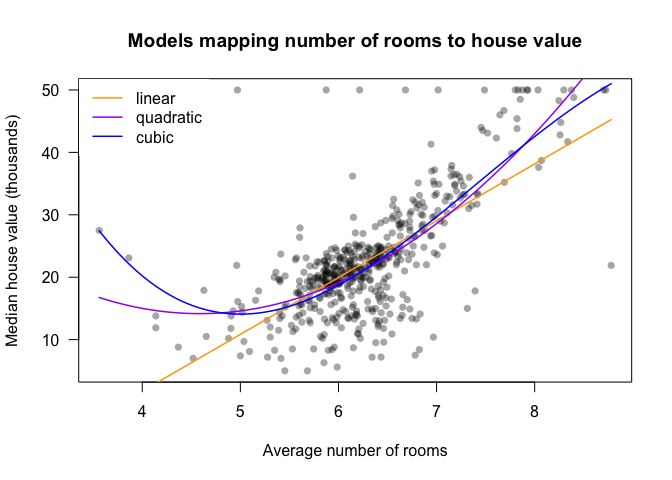
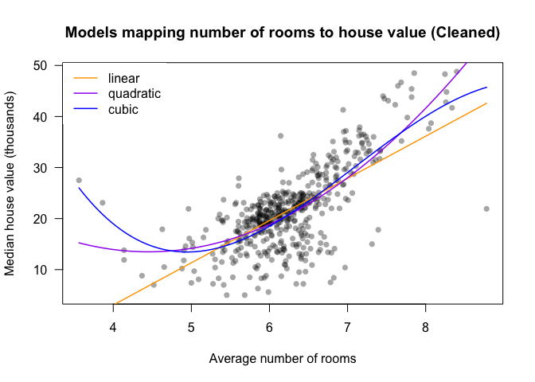
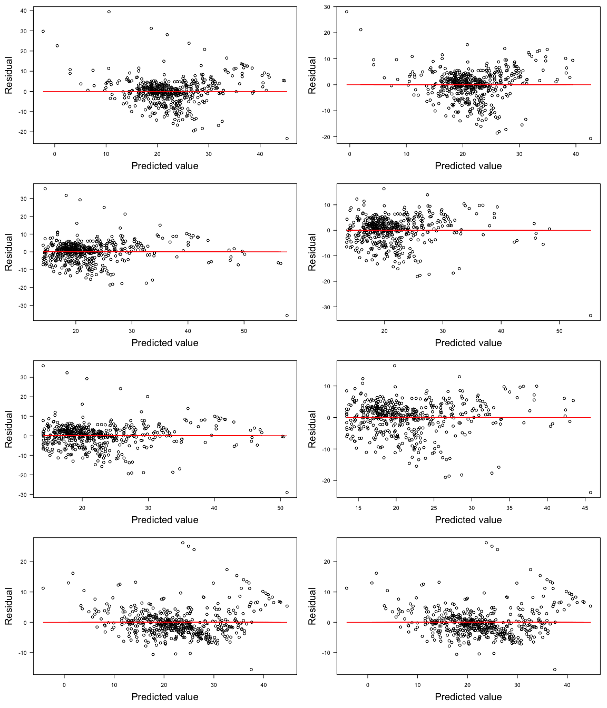

SIT114: Task 5.2D
================
Lyndon Purcell

------------------------------------------------------------------------

**Note to the reader:** Text displayed as `inline code` represents
packages, functions, logical values or indices. Text with a **bold**
emphasis symbolizes parameters for functions. Text written in *italics*
refers to arguments passed to parameters or variable names.

------------------------------------------------------------------------

This document demonstrates the use of linear regression applied to
historical housing values found in the Boston dataset from the `MASS`
package.

## Section 0: Loading the data

First, we will load the data using the `library` function, passing
*MASS* as a parameter. We will then call `head` on *Boston* to confirm
the data has been loaded successfully.

``` r
library(MASS)
head(Boston, 3)
```

    ##      crim zn indus chas   nox    rm  age    dis rad tax ptratio  black lstat
    ## 1 0.00632 18  2.31    0 0.538 6.575 65.2 4.0900   1 296    15.3 396.90  4.98
    ## 2 0.02731  0  7.07    0 0.469 6.421 78.9 4.9671   2 242    17.8 396.90  9.14
    ## 3 0.02729  0  7.07    0 0.469 7.185 61.1 4.9671   2 242    17.8 392.83  4.03
    ##   medv
    ## 1 24.0
    ## 2 21.6
    ## 3 34.7

## Section 1: Fitting a linear model

Our first foray into this dataset will involve fitting a linear model
between two variables, *rm* and *medv*, where we map the former to the
latter. The values in the *rm* column are the average number of rooms
per dwelling and *mdev* is the median value of owner-occupied homes (in
$1,000s).

For this, we will use the `lm` function, passing the variables in the
format of `Y ~ X`. We will also specify the data source as Boston. The
model generated will be bound to the variable *linear_model*. The
coefficients of this model are as follows:

``` r
linear_model <- lm(medv ~ rm, data=Boston)
coef(linear_model)
```

    ## (Intercept)          rm 
    ##  -34.670621    9.102109

The interpretation of *linear_model* is that houses with zero rooms – on
average – have negative value (the *y*-intercept), with each additional
room – again, on average – then adding value to the house (the model’s
slope).

## Section 2: Fitting a quadratic polynomial model

Now that we have a simple, linear model to use as a baseline, let us fit
some more complex models. Importantly, these models cannot do worse, as
the set of possible complex models includes the set of all simpler
alternatives (as coefficients can be set to 0 for any variable).

The next most complex model we could fit, after linear, is a quadratic
polynomial. Here we will use the same two variables, *rm* and *medv*,
only this time allowing for the inclusion of an *rm*-squared term. As
such, the general form of this model is
*y*<sub>*i*</sub> = *f*(*x*<sub>*i*</sub>) = *a**x*<sub>*i*</sub><sup>2</sup> + *b**x*<sub>*i*</sub> + *c*,
where *x*<sub>*i*</sub> is the *rm* value and *y*<sub>*i*</sub> is the
predicted *medv* value.

Fitting a quadratic model – or any polynomial of a higher degree – is
similar to fitting a linear model, except for one difference. When
passing terms that are to be raised to powers, we must wrap these in the
`I` function, which ensures the objects are treated “as is” by the R
interpreter. This is required for the expression to be computed
numerically, as opposed to symbolically, which would occur without the
use of `I`. This is necessary because the arithmetic operators perform
different functions in the default, symbolic context.

``` r
quad_model <- lm(medv ~ rm + I(rm^2), data=Boston)
coef(quad_model)
```

    ## (Intercept)          rm     I(rm^2) 
    ##   66.058847  -22.643262    2.470124

An alternative to `I` is the `poly` function, which takes in a vector of
values and a **degree** parameter specifying the order of the polynomial
expression. However, when using this function in this way, we must also
be careful to set the **raw** parameter to `TRUE`, otherwise an
orthogonal polynomial – as opposed to a raw – will be returned, which
would yield different results

The following code demonstrates this, calculating another, identical
model, only using `poly` instead of `I`:

``` r
quad_model2 <- lm(medv ~ poly(rm, degree=2, raw=TRUE), data=Boston)
coef(quad_model2)
```

    ##                       (Intercept) poly(rm, degree = 2, raw = TRUE)1 
    ##                         66.058847                        -22.643262 
    ## poly(rm, degree = 2, raw = TRUE)2 
    ##                          2.470124

## Section 3: Fitting a cubic polynomial model

Moving in the direction of increased complexity once more, let us know
generate a cubic polynomial model. The generalised form of this model
will thus be
*y*<sub>*i*</sub> = *f*(*x*<sub>*i*</sub>) = *a**x*<sub>*i*</sub><sup>3</sup> + *b**x*<sub>*i*</sub><sup>2</sup> + *c**x*<sub>*i*</sub> + *d*,
where, again, *x*<sub>*i*</sub> is the *rm* value and *y*<sub>*i*</sub>
is the predicted *medv* value.

Using the `I` approach, we get the following:

``` r
cubic_model <- lm(medv ~ rm + I(rm^2) + I(rm^3), data=Boston)
coef(cubic_model)
```

    ##  (Intercept)           rm      I(rm^2)      I(rm^3) 
    ##  241.3108138 -109.3906064   16.4910163   -0.7403937

## Section 4: Plotting the data and the models

Now that we have a number of models we have fit to our data, let us look
at visual representation of how well they do. To accomplish this, we
will first plot our data using the traditional *x* and *y* coordinates,
then overlay our models over the top.

We will load the `scales` package for this, to access the `alpha`
function, allowing us increase the transparency of our plot-points.
Next, we will generate the lines for our models by passing them each a
sequence of values – their *x*-coordinate– and then having them compute
the respective *y* coordinate.

``` r
# To adjust transparency of plot-points
library(scales)

# Plotting the data that each model was trained on
plot(Boston$rm, Boston$medv, 
     main="Models mapping number of rooms to house value",
     xlab="Average number of rooms", ylab="Median house value (thousands)",
     col=alpha("black", 0.35), pch=16, las=1)

# Generating input values (X) to be mapped to outputs (Y)
x_values <- seq(min(Boston$rm), max(Boston$rm), length.out=100)

# Passing the input values to each model
linear_fit <- predict(linear_model, data.frame(rm=x_values))
quad_fit <- predict(quad_model, data.frame(rm=x_values))
cube_fit <- predict(cubic_model, data.frame(rm=x_values))

# Plotting each model
lines(x_values, linear_fit, lwd=1.5, col="orange")
lines(x_values, quad_fit, lwd=1.5, col="purple")
lines(x_values, cube_fit, lwd=1.5, col="blue")

# Adding legend to plot
legend("topleft", legend=c("linear", "quadratic", "cubic"), 
       col=c("orange", "purple", "blue"), lty=1, lwd=1.5, box.lty=0)
```

<!-- -->

As this plot demonstrates, there are some issues with using more complex
models. This will be discussed at greater length in Section 6.

## Section 5: Training new models on cleaned data

Not only does the above plot demonstrate some possible over-fitting of
our models, it also highlights what is potentially an artificial
upper-bound on price at $50,000. We see a number of data-points with
this as their exact *y*-value, while their *x*-values vary drastically.

To rectify this, and see if the subsequent models perform more
effectively, we will create a new data frame that contains the two
variables of interest, but limited to prices below the $50,000
threshold.

``` r
# Creates new cleaned data-frame
cleaned_df <- Boston[Boston$medv < 50, c("rm", "medv")]

# Compares the change in number of rows from original to cleaned
nrow(Boston)
```

    ## [1] 506

``` r
nrow(cleaned_df)
```

    ## [1] 490

As we can see, there have been 16 data points removed in the creation of
our new data-frame.

Next, let’s create some models based on this new data. Then, we will
once more plot them and see how they fare. All graphical parameters will
be kept the same for ease of interpretation.

``` r
# Training new models on the cleaned data
cleaned_linear <- lm(medv ~ rm, data=cleaned_df)
cleaned_quad <- lm(medv ~ rm + I(rm^2), data=cleaned_df)
cleaned_cubic <- lm(medv ~ rm + I(rm^2) + I(rm^3), data=cleaned_df)

# Plotting the cleaned data
plot(cleaned_df$rm, cleaned_df$medv, 
     main="Models mapping number of rooms to house value (Cleaned)",
     xlab="Average number of rooms", ylab="Median house value (thousands)",
     col=alpha("black", 0.35), pch=16, las=1)

# Passing input values to the new models
linear_fit2 <- predict(cleaned_linear, data.frame(rm=x_values))
quad_fit2 <- predict(cleaned_quad, data.frame(rm=x_values))
cube_fit2 <- predict(cleaned_cubic, data.frame(rm=x_values))

# Plotting each model
lines(x_values, linear_fit2, lwd=1.5, col="orange")
lines(x_values, quad_fit2, lwd=1.5, col="purple")
lines(x_values, cube_fit2, lwd=1.5, col="blue")

# Adding legend to plot
legend("topleft", legend=c("linear", "quadratic", "cubic"), 
       col=c("orange", "purple", "blue"), lty=1, lwd=1.5, box.lty=0)
```

<!-- -->

Some subtle differences are apparent, however, the models do appear to
map the cleaned data in a very similar way to the uncleaned.

## Section 6: Predictions using the models

While the two graphs demonstrate that quadratic and cubic models fit the
data more effectively, we should be wary that these models may not
generalise as well to previously unseen data. The goal is for our models
to learn some fundamental pattern regarding the influence of rooms on
housing value, and not just model the intricacies and nuances –
including noise – of our particular dataset.

To test our models, we will now pass each of them a list of new room
values and assess the median-price predictions they return.

``` r
# Vector holding number of new rooms for predictions and other functionality
new_rms <- 4:8

# A list to hold all the models created so far
all_models <- list(linear_model, cleaned_linear, 
                   quad_model, cleaned_quad, 
                   cubic_model, cleaned_cubic)

# Data.frame to hold the results of each model
results <- data.frame()

# Looping through models, making predictions, and adding as a row to results DF
for (model in all_models) {
  predictions <- round(predict(model, data.frame(rm=new_rms)), 2)
  results <- rbind(results, predictions)
}

# Naming columns and rows in results DF
colnames(results) <- c(paste(new_rms, "rms"))
rownames(results) <- c("Linear", "Linear (cleaned)", "Quadratic",
                 "Quadratic (cleaned)", "Cubic", "Cubic (cleaned)")

knitr::kable(results)
```

|                     | 4 rms | 5 rms | 6 rms | 7 rms | 8 rms |
|:--------------------|------:|------:|------:|------:|------:|
| Linear              |  1.74 | 10.84 | 19.94 | 29.04 | 38.15 |
| Linear (cleaned)    |  3.07 | 11.34 | 19.61 | 27.87 | 36.14 |
| Quadratic           | 15.01 | 14.60 | 19.12 | 28.59 | 43.00 |
| Quadratic (cleaned) | 13.94 | 14.16 | 18.85 | 28.00 | 41.62 |
| Cubic               | 20.22 | 14.08 | 18.72 | 29.68 | 42.53 |
| Cubic (cleaned)     | 18.97 | 13.47 | 18.50 | 29.03 | 40.04 |

These results highlight the various flaws of each model. To start with,
looking at the linear models (both cleaned and uncleaned), we see that
they seem to perform poorly with lower *rm* values. The linear models
significantly underestimate the price of 4 room houses – and would value
a house with 3 rooms negatively.

Alternatively, the more complex cubic models track the data too closely
and, as as result, predict that houses with 5 or 6 rooms have lower
median value than those with 4 or 7 rooms. These models appear to
perform poorly with middle-range input values. The quadratic models are
not completely convincing in this area either.

In short, each of the models has imperfections, but erring on the side
of less complexity – linear or quadratic – may be best when applying to
new data. Additionally, if there was some knowledge regarding the
characteristics of the data that the model was going to be applied to,
for example it may be made up of predominantly houses with less rooms
on-average, this may assist with model selection.

## Section 7: Using forward selection to choose variables

Up until this point we have worked only with mapping *rms* to *medv* –
which also included squared and cubed input values. We had a clear idea
of what model we were going to use ahead of time.

In this section, we will allow our input variable(s) to be determined by
a systematic process, where we are choosing a model using an algorithm;
we do not know which variables will be included until the process is
complete. This process will be forward selection with respect to the
Akaike information criterion (AIC). Next we will use its counterpart,
backwards selection.

The AIC is calculated using the following equation, where *f* is the
model, *p* is the number of parameters in the model, and *L̂* is the
maximum value of the likelihood function for the model:

*A**I**C*(*f*) = 2*p* − 2log<sub>*n*</sub>(*L̂*)

Forward selection is a “greedy” approach, which starts with an empty
model and continually adds in the variable that minimizes the AIC the
most, up until adding in another term increases the AIC. At this point
the terms of the model have been selected.

To execute this process with code, we use the `step` function. We
specify the starting point (an empty model), the ultimate end point (a
model using all terms), and a direction (forwards). Then, we execute the
code and the model which most effectively minimizes the AIC, given those
parameters, will be returned to us.

``` r
forward_select <- step(lm(medv~1, data=Boston), 
                       scope=formula(lm(medv~., data=Boston)), 
                       direction="forward")
```

    ## Start:  AIC=2246.51
    ## medv ~ 1
    ## 
    ##           Df Sum of Sq   RSS    AIC
    ## + lstat    1   23243.9 19472 1851.0
    ## + rm       1   20654.4 22062 1914.2
    ## + ptratio  1   11014.3 31702 2097.6
    ## + indus    1    9995.2 32721 2113.6
    ## + tax      1    9377.3 33339 2123.1
    ## + nox      1    7800.1 34916 2146.5
    ## + crim     1    6440.8 36276 2165.8
    ## + rad      1    6221.1 36495 2168.9
    ## + age      1    6069.8 36647 2171.0
    ## + zn       1    5549.7 37167 2178.1
    ## + black    1    4749.9 37966 2188.9
    ## + dis      1    2668.2 40048 2215.9
    ## + chas     1    1312.1 41404 2232.7
    ## <none>                 42716 2246.5
    ## 
    ## Step:  AIC=1851.01
    ## medv ~ lstat
    ## 
    ##           Df Sum of Sq   RSS    AIC
    ## + rm       1    4033.1 15439 1735.6
    ## + ptratio  1    2670.1 16802 1778.4
    ## + chas     1     786.3 18686 1832.2
    ## + dis      1     772.4 18700 1832.5
    ## + age      1     304.3 19168 1845.0
    ## + tax      1     274.4 19198 1845.8
    ## + black    1     198.3 19274 1847.8
    ## + zn       1     160.3 19312 1848.8
    ## + crim     1     146.9 19325 1849.2
    ## + indus    1      98.7 19374 1850.4
    ## <none>                 19472 1851.0
    ## + rad      1      25.1 19447 1852.4
    ## + nox      1       4.8 19468 1852.9
    ## 
    ## Step:  AIC=1735.58
    ## medv ~ lstat + rm
    ## 
    ##           Df Sum of Sq   RSS    AIC
    ## + ptratio  1   1711.32 13728 1678.1
    ## + chas     1    548.53 14891 1719.3
    ## + black    1    512.31 14927 1720.5
    ## + tax      1    425.16 15014 1723.5
    ## + dis      1    351.15 15088 1725.9
    ## + crim     1    311.42 15128 1727.3
    ## + rad      1    180.45 15259 1731.6
    ## + indus    1     61.09 15378 1735.6
    ## <none>                 15439 1735.6
    ## + zn       1     56.56 15383 1735.7
    ## + age      1     20.18 15419 1736.9
    ## + nox      1     14.90 15424 1737.1
    ## 
    ## Step:  AIC=1678.13
    ## medv ~ lstat + rm + ptratio
    ## 
    ##         Df Sum of Sq   RSS    AIC
    ## + dis    1    499.08 13229 1661.4
    ## + black  1    389.68 13338 1665.6
    ## + chas   1    377.96 13350 1666.0
    ## + crim   1    122.52 13606 1675.6
    ## + age    1     66.24 13662 1677.7
    ## <none>               13728 1678.1
    ## + tax    1     44.36 13684 1678.5
    ## + nox    1     24.81 13703 1679.2
    ## + zn     1     14.96 13713 1679.6
    ## + rad    1      6.07 13722 1679.9
    ## + indus  1      0.83 13727 1680.1
    ## 
    ## Step:  AIC=1661.39
    ## medv ~ lstat + rm + ptratio + dis
    ## 
    ##         Df Sum of Sq   RSS    AIC
    ## + nox    1    759.56 12469 1633.5
    ## + black  1    502.64 12726 1643.8
    ## + chas   1    267.43 12962 1653.1
    ## + indus  1    242.65 12986 1654.0
    ## + tax    1    240.34 12989 1654.1
    ## + crim   1    233.54 12995 1654.4
    ## + zn     1    144.81 13084 1657.8
    ## + age    1     61.36 13168 1661.0
    ## <none>               13229 1661.4
    ## + rad    1     22.40 13206 1662.5
    ## 
    ## Step:  AIC=1633.47
    ## medv ~ lstat + rm + ptratio + dis + nox
    ## 
    ##         Df Sum of Sq   RSS    AIC
    ## + chas   1    328.27 12141 1622.0
    ## + black  1    311.83 12158 1622.7
    ## + zn     1    151.71 12318 1629.3
    ## + crim   1    141.43 12328 1629.7
    ## + rad    1     53.48 12416 1633.3
    ## <none>               12469 1633.5
    ## + indus  1     17.10 12452 1634.8
    ## + tax    1     10.50 12459 1635.0
    ## + age    1      0.25 12469 1635.5
    ## 
    ## Step:  AIC=1621.97
    ## medv ~ lstat + rm + ptratio + dis + nox + chas
    ## 
    ##         Df Sum of Sq   RSS    AIC
    ## + black  1   272.837 11868 1612.5
    ## + zn     1   164.406 11977 1617.1
    ## + crim   1   116.330 12025 1619.1
    ## + rad    1    58.556 12082 1621.5
    ## <none>               12141 1622.0
    ## + indus  1    26.274 12115 1622.9
    ## + tax    1     4.187 12137 1623.8
    ## + age    1     2.331 12139 1623.9
    ## 
    ## Step:  AIC=1612.47
    ## medv ~ lstat + rm + ptratio + dis + nox + chas + black
    ## 
    ##         Df Sum of Sq   RSS    AIC
    ## + zn     1   189.936 11678 1606.3
    ## + rad    1   144.320 11724 1608.3
    ## + crim   1    55.633 11813 1612.1
    ## <none>               11868 1612.5
    ## + indus  1    15.584 11853 1613.8
    ## + age    1     9.446 11859 1614.1
    ## + tax    1     2.703 11866 1614.4
    ## 
    ## Step:  AIC=1606.31
    ## medv ~ lstat + rm + ptratio + dis + nox + chas + black + zn
    ## 
    ##         Df Sum of Sq   RSS    AIC
    ## + crim   1    94.712 11584 1604.2
    ## + rad    1    93.614 11585 1604.2
    ## <none>               11678 1606.3
    ## + indus  1    16.048 11662 1607.6
    ## + tax    1     3.952 11674 1608.1
    ## + age    1     1.491 11677 1608.2
    ## 
    ## Step:  AIC=1604.19
    ## medv ~ lstat + rm + ptratio + dis + nox + chas + black + zn + 
    ##     crim
    ## 
    ##         Df Sum of Sq   RSS    AIC
    ## + rad    1   228.604 11355 1596.1
    ## <none>               11584 1604.2
    ## + indus  1    15.773 11568 1605.5
    ## + age    1     2.470 11581 1606.1
    ## + tax    1     1.305 11582 1606.1
    ## 
    ## Step:  AIC=1596.1
    ## medv ~ lstat + rm + ptratio + dis + nox + chas + black + zn + 
    ##     crim + rad
    ## 
    ##         Df Sum of Sq   RSS    AIC
    ## + tax    1   273.619 11081 1585.8
    ## <none>               11355 1596.1
    ## + indus  1    33.894 11321 1596.6
    ## + age    1     0.096 11355 1598.1
    ## 
    ## Step:  AIC=1585.76
    ## medv ~ lstat + rm + ptratio + dis + nox + chas + black + zn + 
    ##     crim + rad + tax
    ## 
    ##         Df Sum of Sq   RSS    AIC
    ## <none>               11081 1585.8
    ## + indus  1   2.51754 11079 1587.7
    ## + age    1   0.06271 11081 1587.8

Using this method, the chosen model includes all variables except for
*indus* and *age*.

## Section 8: Using backward selection to choose variables

The backwards selection process is fundamentally the same, only in
reverse. The starting point is a full model, with the term being dropped
that minimizes the AIC the most, up until the point where dropping any
term would increase the score.

``` r
backwards_select <- step(lm(medv~., data=Boston),
                         scope=formula(lm(medv~1, data=Boston)),
                         direction="backward")
```

    ## Start:  AIC=1589.64
    ## medv ~ crim + zn + indus + chas + nox + rm + age + dis + rad + 
    ##     tax + ptratio + black + lstat
    ## 
    ##           Df Sum of Sq   RSS    AIC
    ## - age      1      0.06 11079 1587.7
    ## - indus    1      2.52 11081 1587.8
    ## <none>                 11079 1589.6
    ## - chas     1    218.97 11298 1597.5
    ## - tax      1    242.26 11321 1598.6
    ## - crim     1    243.22 11322 1598.6
    ## - zn       1    257.49 11336 1599.3
    ## - black    1    270.63 11349 1599.8
    ## - rad      1    479.15 11558 1609.1
    ## - nox      1    487.16 11566 1609.4
    ## - ptratio  1   1194.23 12273 1639.4
    ## - dis      1   1232.41 12311 1641.0
    ## - rm       1   1871.32 12950 1666.6
    ## - lstat    1   2410.84 13490 1687.3
    ## 
    ## Step:  AIC=1587.65
    ## medv ~ crim + zn + indus + chas + nox + rm + dis + rad + tax + 
    ##     ptratio + black + lstat
    ## 
    ##           Df Sum of Sq   RSS    AIC
    ## - indus    1      2.52 11081 1585.8
    ## <none>                 11079 1587.7
    ## - chas     1    219.91 11299 1595.6
    ## - tax      1    242.24 11321 1596.6
    ## - crim     1    243.20 11322 1596.6
    ## - zn       1    260.32 11339 1597.4
    ## - black    1    272.26 11351 1597.9
    ## - rad      1    481.09 11560 1607.2
    ## - nox      1    520.87 11600 1608.9
    ## - ptratio  1   1200.23 12279 1637.7
    ## - dis      1   1352.26 12431 1643.9
    ## - rm       1   1959.55 13038 1668.0
    ## - lstat    1   2718.88 13798 1696.7
    ## 
    ## Step:  AIC=1585.76
    ## medv ~ crim + zn + chas + nox + rm + dis + rad + tax + ptratio + 
    ##     black + lstat
    ## 
    ##           Df Sum of Sq   RSS    AIC
    ## <none>                 11081 1585.8
    ## - chas     1    227.21 11309 1594.0
    ## - crim     1    245.37 11327 1594.8
    ## - zn       1    257.82 11339 1595.4
    ## - black    1    270.82 11352 1596.0
    ## - tax      1    273.62 11355 1596.1
    ## - rad      1    500.92 11582 1606.1
    ## - nox      1    541.91 11623 1607.9
    ## - ptratio  1   1206.45 12288 1636.0
    ## - dis      1   1448.94 12530 1645.9
    ## - rm       1   1963.66 13045 1666.3
    ## - lstat    1   2723.48 13805 1695.0

Once more, the model selected model uses all variables except for
*indus* and *age*, only this time getting to this point via elimination
rather than inclusion. Importantly, however, this result is not always
guaranteed. As greedy algorithms optimise for local maxima, it is not
certain that backwards selection will return the same result as forwards
selection. The argument *“both”* can be passed to the **direction**
parameter as a means of utilizing the two directions.

## Section 9: Calculating descriptive statistics for all models

By this stage of our analysis, we have fit several different models. In
practice, however, we cannot only train models; we must select and
deploy them. Selecting which model can be difficult, though. To make the
job easier for ourselves, we can calculate some descriptive statistics
for each to aid in comparison and understanding trade-offs.

The following code computes the AIC, RMSE, MAE, and adjusted
R<sup>2</sup> for all the models considered so far.

``` r
# Adding the two models created using AIC
all_models[[length(all_models)+1]] <- forward_select
all_models[[length(all_models)+1]] <- backwards_select

# Creates an empty DF to store descriptive stats in
models_df <- data.frame()

# Iterates through models, calculating all stats, storing them in a list and adding as a row
for (model in all_models) {
  aic <- AIC(model)
  rmse <- sqrt(mean(model$residuals^2))
  mae <- mean(abs(model$residuals))
  arsq <-summary(model)$adj.r.squared
  model_stats <- list(aic, rmse, mae, arsq)
  models_df <- rbind(models_df, model_stats)
}

# Gives DF meaningful names for rows and columns 
colnames(models_df) <- c("AIC", "RMSE", "MAE", "Adj. R-Sq.")
rownames(models_df) <- c("Linear", "Linear (cleaned)", "Quad.", "Quad. (cleaned)",
                         "Cubic", "Cubic (cleaned)", "For. Select", "Back. Select")
  
knitr::kable(models_df)
```

|                  |      AIC |     RMSE |      MAE | Adj. R-Sq. |
|:-----------------|---------:|---------:|---------:|-----------:|
| Linear           | 3352.151 | 6.603071 | 4.447773 |  0.4825007 |
| Linear (cleaned) | 3104.322 | 5.712260 | 4.110837 |  0.4703836 |
| Quad.            | 3286.202 | 6.174278 | 4.224455 |  0.5466301 |
| Quad. (cleaned)  | 3048.860 | 5.386951 | 3.962658 |  0.5280212 |
| Cubic            | 3273.652 | 6.086142 | 4.173545 |  0.5586036 |
| Cubic (cleaned)  | 3031.276 | 5.280369 | 3.925011 |  0.5455798 |
| For. Select      | 3023.726 | 4.679736 | 3.272036 |  0.7348058 |
| Back. Select     | 3023.726 | 4.679736 | 3.272036 |  0.7348058 |

The above table provides a great overview of how our models compare to
one another. When interpreting this table, we must be mindful of a few
things; namely that each measure tells us something slightly different
about the model, and that lower AIC, RMSE and MAE scores suggest a
better model, whereas a higher adjusted R<sup>2</sup> score is
suggestive of a better model.

Using this knowledge, we can conclude that the models generated by
forwards and backwards selection (which are identical) are the best.
They have the lowest AIC, RMSE and MAE scores, as well as the highest
adjusted R<sup>2</sup> score. This indicates they are not only
well-performing, but they do not have any obvious weaknesses – such as
potential for overfitting – at least as measured by these statistics.

## Section 10: Plotting residuals as a function of predicted output

In this final section, we will draw plot the residuals (*ŷ* − *y*) as a
function of predicted output (*ŷ*). The purpose of this is to illuminate
whether our models are systematically biased when making predictions in
any areas along the spectrum of their output.

``` r
# Setting graphical parameters
par(mfrow=c(4,2), mar=c(5,5,1,1)) 

# Iterate through all models
for (model in all_models) {
  # Plot residuals (Y) as a function of fitted values (X)
  plot(model$fitted.values, model$residuals, xlab="Predicted value", 
       ylab="Residual", las=1, cex.lab=1.75)
  # Add the line indicating zero residual
  zeros <- rep(0, length(model$fitted.values)) 
  lines(model$fitted.values, zeros, col="red") 
}
```

<!-- -->

The above plots are ordered as follows, by row:

1.  Linear, Linear (cleaned);

2.  Quadratic, Quadratic (cleaned);

3.  Cubic, Cubic (cleaned);

4.  Forward selection, Backwards selection.

These plots help us visualize where our models are making mistakes, and
by how much. For example, we can see the influence of the possibly
artificial $50,000 *medv* limit. A straight line, that trends towards
zero, can be seen in the plots involving models trained on uncleaned
data.

This evidence of a deterministic pattern in the plots suggests that
there is a systematic bias in the models. A well performing model would
be random regarding its residual-values – though the average should be
zero.
