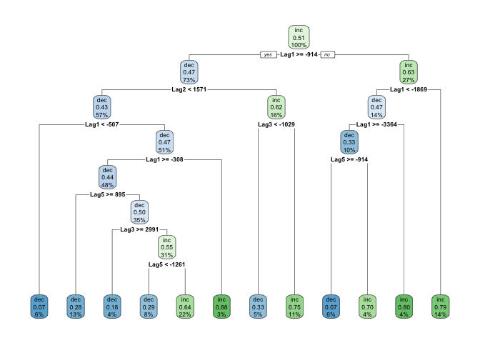

SIT114: Task 6.1P
================
Lyndon Purcell

------------------------------------------------------------------------

**Note to the reader:** Text displayed as `inline code` represents
packages, functions, logical values and indices. Text with a **bold**
emphasis symbolizes parameters for functions. Text written in *italics*
refers to arguments passed to parameters and variable names.

------------------------------------------------------------------------

This document demonstrates the use of classification algorithms, such as
decision trees, *K*-NN, and binary logistic regression. The data for
this task will be pre-processed, Bitcoin (BTC) to United States Dollars
(USD) exchange rates from the year 2021.

## Section 0: Loading the data

First, the data will be loaded by calling the `read.csv` function,
passing it a file path that specifies the location of the data, as well
as the character used to denote comments in the dataset.

The function `colnames` will then be called to confirm this worked and
to give us some insight into the variables at our disposal.

``` r
data <- read.csv("/Users/LJPurcell/Desktop/Deakin/SIT114/Data/btcusd_change_2021.csv", comment.char="#")
colnames(data)
```

    ## [1] "Date"   "Close"  "Change" "Dir"    "Lag1"   "Lag2"   "Lag3"   "Lag4"  
    ## [9] "Lag5"

Next, we will perform a train-test split.

## Section 1: Splitting the data into train and test sets

In order to produce models that not only describe and predict the data
we have available, but also generalise well to unseen instances, one
method we can implement is a train-test split. The idea here is to
reserve a portion of our data – rendering the instances as “unseen” by
the model – for testing purposes. This will give us relevant insights
into the model’s performance, without first needing to deploy it.

For this particular case, we will split the data 70:30 for training and
testing, respectively. For some datasets, it is important to randomise
the process by which data-points are allocated for training or testing.
However, as this is time-series data, this method would not be viable.
Instead, we will simply assign the first 70% of observations,
chronologically speaking, to the training set. The remainder will be
used for testing.

As the dataset lists the earliest instance in the first row, and the
latest instance in the last row, we can use operations on rows to
perform the split.

``` r
# Number of observations
n <- nrow(data)

# First 70% of observations for training
train_indices <- 1:floor(0.7*n)
Smarket_train <- data[train_indices,]

# Remaining 30% of more recent observations for testing
Smarket_test <- data[-train_indices,]
```

Next, let’s put our sets to use.

## Section 2: Creating a decision tree

In this section, we will create a decision tree; a highly interpretable
classification model. To do so, we will use the `rpart` package.
`rpart.plot` will also be used to visualise the resultant tree. The
`knitr` package will also be loaded to allow for nicer formatted tables.
Finally, the `set.seed` function will be called with the argument *123*
in order to allow for reproducibility.

``` r
library(rpart)
library(rpart.plot)
library(knitr)
set.seed(123)
```

Next, we will specify the kind of tree we want to construct. The `rpart`
function has a formula interface, so we can specify our independent and
dependant variables in the same way as we have previously for
regression. We must also, then, specify the data and method to be
implemented, which are *Smarket_train* and *“class”* (for
classification), respectively. The **cp** parameter can be used to
determine the complexity of the model, with lower values resulting in
more complex trees. The tree created from this procedure will be bound
to the variable *dir_tree*.

``` r
# Decision tree predicting Dir based on five Lag variables
dir_tree <- rpart(Dir~Lag1+Lag2+Lag3+Lag4+Lag5, data=Smarket_train, method="class", cp=0.02)
```

We can view our model by calling `rpart.plot` and passing *dir_tree*.

``` r
rpart.plot(dir_tree)
```

<!-- -->

Now that we have a model, we must test its performance. First, we will
construct a helper function that will compute the relevant statistics,
so that we can easily output the performance of many different models.

This function, called `performance_metrics` will take in a vector of
classification predictions (*Y_pred*) and a vector containing the actual
classification for each observation (*Y_actual*). Using these two
vectors, a confusion matrix can be created using the `table` function.
This table can then be indexed to easily calculate various measures of
performance, such as precision and sensitivity.

``` r
performance_metrics <- function(Y_pred, Y_actual) {
  CM <- table(Y_pred, Y_actual)
  stopifnot(dim(CM) == c(2,2)) # Guard clause
  c(Acc    =((CM[1,1] + CM[2,2]) / sum(CM)),
    Prec   =  CM[2,2] / (CM[2,1] + CM[2,2]),
    Sens   = (CM[2,2] / (CM[1,2] + CM[2,2])),
    F_meas =  CM[2,2] / (CM[2,2] + 0.5*CM[2,1] + 0.5*CM[1,2]),
    TN     =  CM[1,1],  FP     =  CM[2,1], 
    FN     =  CM[1,2],  TP     =  CM[2,2]
    ) # Returns a labelled vector
}
```

Now that we have our function for calculating performance, we need to
ensure we have the correct arguments to pass it – a vector of
classification predictions, and a vector of actual classifications.

Predictions are generated using the `predict` function – again, as we
did with the regression models previously. This time we must be sure to
pass in *Smarket_test*, as this contains the data we will be using to
make our predictions. The results are then bound to *dir_pred*.

Our function `performance_metrics` can then be called passing in
*dir_pred* as well as the *Dir* column of *Smarket_test*, which contains
the correct classification values.

``` r
# Makes predictions for new data using dir_tree
dir_pred <- predict(dir_tree, Smarket_test, type="class")

# Performance metrics comparing predicted versus actual Dir outcomes
kable(t(performance_metrics(dir_pred, Smarket_test$Dir)), digits=3)
```

|   Acc |  Prec |  Sens | F_meas |  TN |  FP |  FN |  TP |
|------:|------:|------:|-------:|----:|----:|----:|----:|
| 0.574 | 0.559 | 0.623 |  0.589 |  29 |  26 |  20 |  33 |

The performance of this model is decent, but it isn’t stellar by any
means. This may be due to the limited size of the training set; the
inherent unpredictability of the stock market data; poor hyperparameter
selection (i.e., **cp**); or something else entirely.

## Section 3: Binary logistic regression

In order to try and improve our classification performance, we could try
fitting a different model. This time we will train – and test – a binary
logistic regression model.

Binary logistic regression models (BLR) produce classifications, where
there are only two possible alternatives for *Y*, given some input
value(s) *X*. The intermediate results of these models are probability
estimates (0,1), and we can then encode our final output – the
classification – based on these real numbers. This process entails using
the value of 1 as true, and 0 as false; if $\\hat{y_i}\>0.5$ then
$\\hat{y_i} \\mapsto True$, otherwise $\\hat{y_i} \\mapsto False$. As we
are interested in predicting a binary outcome – whether the BTC price
increased or decreased – a BLR model is appropriate.

In order to train the model, however, we must first have data that is in
the correct format. To achieve this, we can create a new column in both
our train and test datasets that represents whether the price went up or
down using 1s and 0s – as opposed to strings of characters. This can
easily be achieved by creating a Boolean expression and converting the
result to a number. This vector of numbers are then passed to the
function `factor`; this can prevent inappropriate arithmetic operations
being performed on them, even though they are numbers.

``` r
# Append new column to datasets encoding price increase as 1 and decrease as 0
Smarket_train$WentUp <- factor(as.numeric(Smarket_train$Dir == "inc"))
Smarket_test$WentUp <- factor(as.numeric(Smarket_test$Dir == "inc"))
kable(head(Smarket_train[c("Dir", "WentUp")]))
```

| Dir | WentUp |
|:----|:-------|
| inc | 1      |
| inc | 1      |
| dec | 0      |
| dec | 0      |
| dec | 0      |
| dec | 0      |

Now that our data is in a more accessible format, we can train our
model. Binary logistic regression models are a generalised form of
linear models – the log-odds of the probability estimates are mapped by
a linear function – and, as such, training these models requires a call
to the `glm` function.

As with other regression models, we can specify input and output
variables as a formula; in this case, we want to train the model to
predict *WentUp* as a function of all the *Lag* variables (1 to 5).
*Smarket_train* will be passed to the **data** parameter, and the
**family** parameter must be passed the `binomial` function with its own
argument *“logit”* – a term used to denote logistic regression. We can
then see the coefficients of the resultant model, *dir_logit*, by
passing it to the `coefficients` function.

``` r
dir_logit<-glm(WentUp~Lag1+Lag2+Lag3+Lag4+Lag5, data=Smarket_train, family=binomial("logit"))
kable(coefficients(dir_logit))
```

|             |          x |
|:------------|-----------:|
| (Intercept) |  0.0580957 |
| Lag1        | -0.0000863 |
| Lag2        |  0.0000283 |
| Lag3        |  0.0000431 |
| Lag4        |  0.0000104 |
| Lag5        | -0.0000349 |

Next, we will assess the performance of our BLR model, *dir_logit*. We
can once more achieve this by making predictions using input variables
from our previously unseen test set, and seeing how the predictions
compare to the actual classification.

``` r
# Generating predictions using the test set
logit_preds <- factor(as.numeric(predict(dir_logit, Smarket_test, type="response") > 0.5))

# Performance metrics comparing predicted versus actual outcomes
kable(t(performance_metrics(logit_preds, Smarket_test$WentUp)), digits=3)
```

| Acc |  Prec |  Sens | F_meas |  TN |  FP |  FN |  TP |
|----:|------:|------:|-------:|----:|----:|----:|----:|
| 0.5 | 0.492 | 0.566 |  0.526 |  24 |  31 |  23 |  30 |

These metrics indicate that the model is rather poor; it does not
perform as well as our previous classification model based on a decision
tree.

## Section 4: *K*-nearest neighbours

The final classification method we will consider in this report is
*K*-nearest neighbours (K-NN). For this algorithm, *K* is a
hyperparameter which represents an integer. This value is then used to
determine how many of the closest surrounding instances are to be
considered when making a classification.

In this section we will be using *K* = 5. This means that a new instance
will be classified in the same way as the most common classification
amongst the 5 other nearest instances.

To implement our 5-NN algorithm, we will use the `FNN` package.

``` r
library("FNN")
```

Before we generate our predictions, we will first do some data-wrangling
to better isolate the variables of interest from the rest of the data.
We will create two sub-data-frames of our *Smarket_train* and
*Smarket_test* data-frames. These new data-frames will only include the
predictor variables (*Lag* 1 to 5) for both the train and test set.

``` r
lags_train <- Smarket_train[, c("Lag1","Lag2","Lag3","Lag4","Lag5")]
lags_test <- Smarket_test[, c("Lag1","Lag2","Lag3","Lag4","Lag5")]
```

Next, we will make our predictions. To do so we must pass all the
relevant data to the `knn` function. This is because *K*-NN is a
model-free method; it must have access to each instance in order to make
new classifications. As such, it is only a predictive process and cannot
produce an abstracted formula for descriptive purposes.

The code below passes *lags_train* as the input training values,
*lags_test* as the input values to make new predictions based on,
*Smarket_train$Dir* as the correct classification of the *lags_train*
values, and specifies **k** as 5. The function `head` is then called to
demonstrate the first 6 predictions.

``` r
dir_5nn <- knn(train=lags_train, test=lags_test, cl=Smarket_train$Dir, k=5)
head(dir_5nn)
```

    ## [1] inc dec dec inc dec inc
    ## Levels: dec inc

Making predictions is one thing; making accurate predictions is another.
So, as we have done with all our other methods so far, we will assess
the performance of this approach. Once more we will pass the predicted
outputs and the correct classifications to our function
`performance_metrics`.

``` r
kable(t(performance_metrics(dir_5nn, Smarket_test$Dir)), digit=3)
```

|   Acc |  Prec |  Sens | F_meas |  TN |  FP |  FN |  TP |
|------:|------:|------:|-------:|----:|----:|----:|----:|
| 0.556 | 0.537 | 0.679 |    0.6 |  24 |  31 |  17 |  36 |

This method is another moderate performer, though it is probably the
best we have seen thus far; particularly, if we look at the F-measure –
which takes into consideration both sensitivity and recall/precision.
Which measure should we pay most attention to, though? This will be
discussed further in the next, and final, section.

## Section 5: Discussion and summary

Throughout this report we have looked at a variety of classification
methods – namely decision trees, binary logistic regression, and *K*-NN.
We have also gained insights into their ease of construction,
interpretability, and performance.

When assessing performance we have focused on measures such as accuracy,
precision, sensitivity/recall, and the F-measure. This naturally
produces a follow up question, though: Which is the best measure of
performance in this context?

Although it would depend on the exact intentions of how the model was
going to be used, as well as the constraints on the user or company, I
am inclined to argue that accuracy is the most important metric. While
accuracy can at times be considered too simple or rudimentary (much like
*K*-NN can), in this instance, it seems one of the most appropriate.
This is due to the symmetry (and scale) within the problem being
considered.

In alternative applications, such as a medical setting for example,
sensitivity may be a more applicable measure. If someone has a brain
tumour, it is essential that the model indicates this – it cannot be
left undetected, and therefore untreated. Erring on the side of false
positives may be the best approach.

Conversely, in a legal setting, precision may be more relevant; the
model should only suggest guilty when there is highly conclusive
evidence. Erring on the side of false negatives may be more applicable
in this case, where it is (potentially) better to not punish someone who
is guilty and avoid punishing someone who is innocent.

In the domain of the stock market, however, there is a much more
symmetric relationship at play. A gain of $10 is offset exactly by a
loss of $10, and vice-versa. Furthermore, a gain of $50 is exactly twice
as good as a gain of $25. For this reason, a broader measure of
performance, like accuracy – or F-measure – seems most appropriate.

Though, it should be noted that this logic is not completely robust;
there are various contextual factors which may make focused measures
more relevant. A new finance company may need to be conservative,
ensuring it does not lose money, at the risk of not maximising returns.
Alternatively, in a bull-market, established companies may need more
aggressive strategies, where a higher risk of losses is tolerated in an
attempt to out-earn competitors. These examples indicate situations
where a measure other than accuracy, with more niche connotations, would
likely be best.
