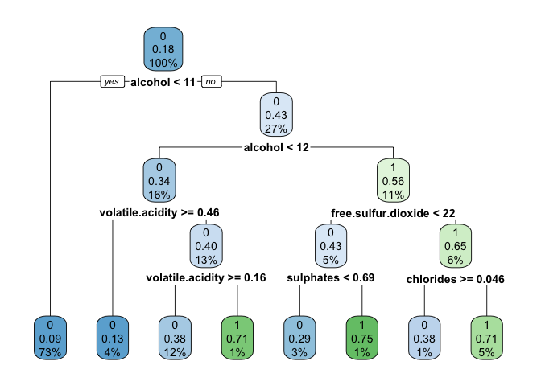

SIT114: Task 6.1P
================
Lyndon Purcell

------------------------------------------------------------------------

**Note to the reader:** Text displayed as `inline code` represents
packages, functions, logical values and indices. Text with a **bold**
emphasis symbolizes parameters for functions. Text written in *italics*
refers to arguments passed to parameters and variable names.

------------------------------------------------------------------------

This document will demonstrate the use of statistical learning
procedures for classification tasks – focusing on tree-based models.
Consideration will also be given to model performance metrics, as well
as a manner by which they can be improved: Ensemble methods. The data
used throughout is the popular Wine Quality dataset (available
[here](https://archive.ics.uci.edu/ml/datasets/Wine+Quality)).

## Section 1: Load the data

First, we will load the data using `read.csv`. We then confirm this
worked by calling `colnames`, which also gives us some insight into the
data’s parameters.

``` r
wines <- read.csv("/Users/LJPurcell/Desktop/Deakin/SIT114/Data/winequality-all.csv", comment.char="#")
colnames(wines)
```

    ##  [1] "fixed.acidity"        "volatile.acidity"     "citric.acid"         
    ##  [4] "residual.sugar"       "chlorides"            "free.sulfur.dioxide" 
    ##  [7] "total.sulfur.dioxide" "density"              "pH"                  
    ## [10] "sulphates"            "alcohol"              "response"            
    ## [13] "color"

## Section 2: Add “quality” column

Next, we will add a new column; a binary variable that states whether a
wine is considered “quality” or not. As we saw above, there is a
*response* variable, which denotes a rating that the wine was given. The
*quality* column, that the code below appends to the dataset, is based
on the values in the *response* column. If a wine has a response rating
of greater-than or equal-to 7, it will be marked as a quality wine –
symbolised by a 1; non-quality wines will contain a zero (0) value.

This is achieved by assigning the result of the relevant Boolean
expression based on *response*, which is then converted to a number, and
treated as a factor, to the new *quality* column. The code below
implements this.

``` r
wines$quality <- factor(as.numeric(wines$response >= 7))
```

## Section 3: Randomised train-test split

In order to accurately determine our model’s performance, we must have
data to test it on. This is difficult, however, if we use all our data
to train the model. In this case, we would simply be showing our model
instances that it had been exposed to before. We would then expect the
model to perform quite well – though, this would not necessarily be a
true reflection of how effective the model would be in practice. It
would be merely familiar with the data; not a well-performing model.

To prevent this problem, we can reserve some of our data and use it for
testing purposes. This reduces the amount of data that our model can be
trained on, but gaining accurate insights into the model’s performance
is typically worth the trade-off. To minimise the influence of any kind
of selection bias, we should randomise the allocation of observations to
the training and testing set.

As our dataset lists each observation as a row, we can select our
training set by indexing into a randomised subset of rows. This is
executed below by using the `sample` function, which by default does not
use replacement, on 70% of the number of rows – denoted by *n*.

``` r
# Randomly selecting 70% of instances for training
n <- nrow(wines)
train_indices <- sample(floor(n*0.7))

# Separating data into training and testing subsets
XY_train <- wines[train_indices,]
XY_test <- wines[-train_indices,]

# Separating training data into X and Y subsets
X_train <- XY_train[, !names(XY_train) %in% c("response", "color", "quality")]
Y_train <- XY_train[,"quality"]

# Separating testing data into X and Y subsets
X_test <- XY_test[, !names(XY_test) %in% c("response", "color", "quality")]
Y_test <- XY_test[,"quality"]
```

We now have a number of data subsets, which will allow us to train and
test our models with much greater confidence.

## Section 4: Decision tree construction

The first model we will construct will be a basic decision tree;
subsequent models will then use this as a building block to construct
more complex – and potentially effective – learners.

In order to grow, and plot, the decision tree, we will need to load the
following packages. The randomisation seed is also set, using `set.seed`
to allow for reproducibility.

``` r
# Load relevant libraries and set randomisation seed
library(rpart)
library(rpart.plot)
library(knitr)
set.seed(123)
```

To construct the decision tree, we simply call the `rpart` function –
short for recursive partitioning – and pass the appropriate parameters.
For our purposes here, we wish our model to learn a mapping from the
various characteristics of each wine, to the resultant *quality* label.
As such, we specify a formula, using the *X_train* and *Y_train*
data-frames, which allows the model to create a decision tree of
*quality* as a function of all the variables. The complexity of the
model is also specified using the **cp** parameter.

The resultant model is then plotted using the call to to `rpart.plot`.

``` r
# Grows and plots decision tree
quality_tree <- rpart(Y_train~., data=X_train, method="class", cp=0.01)
rpart.plot(quality_tree)
```

<!-- -->

While we now know what our model looks like, we do not have a clear idea
of how it performs. To give us some clarity in this department, we will
define a function that produces performance metrics. This function will
aptly be named `performance_metrics` and will return a named vector
containing the accuracy, precision, recall, and F-measure of the model.

A second function, named `confusion_matrix`, is also defined which
displays a labelled and nicely-formatted confusion matrix for the model.

``` r
# Defines function for calculating model performance metrics
performance_metrics <- function(Y_pred, Y_actual) {
  CM <- table(Y_pred, Y_actual)
  stopifnot(dim(CM) == c(2,2))
  metrics <- t(c(
      Acc    =  (CM[1,1] +  CM[2,2]) / sum(CM),
      Prec   =   CM[2,2] / (CM[2,1]  + CM[2,2]),
      Rec    =   CM[2,2] / (CM[1,2]  + CM[2,2]),
      F_meas =   CM[2,2] / (CM[2,2]  + 0.5*CM[1,2] + 0.5*CM[2,1])
      )
    )
}

# Defines function for calculating and displaying model's confusion matrix
confusion_matrix <- function(Y_pred, Y_actual) {
  CM <- table(Y_pred, Y_actual)
  rownames(CM) <- c("Predicted 0", "Predicted 1")
  colnames(CM) <- c("Actual 0", "Actual 1")
  kable(CM)
}
```

Now, we have a model, as well as means for determining its performance.
All that remains is to trial it on previously unseen data, the test set.

The following code generates predictions, using the test set as input,
and then compares the predictions to the correct labels for the test
set. The performance metrics are also computed, inserted into a newly
created data-frame called *results*, and displayed.

``` r
# Generate predictions using the decision tree
tree_preds <- predict(quality_tree, X_test, type="class")

# Compute performance metrics and store in results data-frame
tree_perf <- performance_metrics(tree_preds, Y_test)
results <- data.frame()
results <- rbind(results, tree_perf)

# Output model metrics
kable(tree_perf, digits=3)
```

|   Acc |  Prec |   Rec | F_meas |
|------:|------:|------:|-------:|
| 0.764 | 0.473 | 0.415 |  0.442 |

The performance metrics of our model tell a mixed tale. The accuracy
measure is relatively high, whilst the others are comparatively low.
This potentially indicates an asymmetry within the problem. A call to
`confusion_matrix` will provide greater insight.

``` r
confusion_matrix(tree_preds, Y_test)
```

|             | Actual 0 | Actual 1 |
|:------------|---------:|---------:|
| Predicted 0 |     1308 |      257 |
| Predicted 1 |      203 |      182 |

By assessing the confusion matrix, we have a better idea of why the
performance metrics appeared as they do. While the accuracy is high, we
can see that the model predominantly needs to – and does – output
negative/false/zero values. If our model was to simply output negative
for each prediction, no matter the input, it would still have a decently
high accuracy when implemented on the test set. This asymmetry indicates
we should potentially pay more attention to the more holistic
performance measures.

## Section 5: Ensemble learning - Random forest

Ensemble learning is the process of combining multiple models in order
to produce better outcomes. This aggregation of multiple models is an
effective way of reducing variance, without producing a comparable rise
in bias. Random forests further improve the variance-bias trade-off – in
comparison to more standard “bagging” – by also randomising parameter
selection. This de-correlates the trees that are produced and prevents
the most dominant parameters from being the major decision boundary in
each – which would contradict the purpose of constructing multiple
trees, if they were all extremely similar in nature.

To create our random forest model, we will use the `randomForest`
package.

``` r
library(randomForest)
```

To create the random forest model, we make a call to `randomForest` and
pass the relevant parameter – as we did with `rpart`. The only
difference is rather than specifying complexity of our tree, this time
we specify the complexity of the forest; by determining how many trees
it will contain. For parameter selection, by default, the model will use
$\\sqrt{p}$ on each iteration for the set of *p* parameters.

``` r
# Train random forest model
rf_model <- randomForest(Y_train~., data=X_train, ntree=800)
```

Once we have our model, we use it to make predictions for the test set.

``` r
# Generate predictions using the random forest
rf_predicts <- predict(rf_model, X_test, type="class")
```

These predictions are then compared to the test set labels, as we did
with the decision tree. The performance metrics are calculated and
displayed, as well as added to the *results* data-frame.

``` r
# Compute performance metrics and store in results data-frame
rf_perf <- performance_metrics(rf_predicts, Y_test)
results <- rbind(results, rf_perf)

# Output model metrics and confusion matrix
kable(rf_perf, digits=3)
```

|   Acc |  Prec |   Rec | F_meas |
|------:|------:|------:|-------:|
| 0.769 | 0.487 | 0.524 |  0.505 |

``` r
confusion_matrix(rf_predicts, Y_test)
```

|             | Actual 0 | Actual 1 |
|:------------|---------:|---------:|
| Predicted 0 |     1269 |      209 |
| Predicted 1 |      242 |      230 |

These results indicate that the random forest ensemble model outperforms
the single decision tree model, predominantly by an improvement in
recall (which then influences the F-measure).

## Section 6: Ensemble learning - Boosting

The second ensemble method we will consider is boosting – specifically
XGBoost (short for eXtra Gradient Boosting). While bagging leverages
randomisation and averaging to improve model performance, the
effectiveness of boosting comes from focusing on errors and iterative
learning. Boosting creates “weak learners” that build on top of each
other; bagging does not.

To implement our boosting algorithm, we will use the the `xgboost`
package.

``` r
library(xgboost)
```

The interface of this model is very similar to ones we have considered
so far. When training our model, we have a choice between `xgboost` and
`xgb.train`, where the former is a simplified wrapper for the latter.
For our purposes here, we will make use of the simpler version.

Before we can do that, though, we must convert our data into a usable
format. The `xgboost` function does not accept data-frames, so we must
convert the training and testing data to matrices.

``` r
# Convert data-frames to matrices; required for xgboost compatibility
X_train <- as.matrix(X_train)
Y_train <- as.matrix(Y_train)
X_test <- as.matrix(X_test)
```

We now have all that we need to train our next model. Like the others,
we will generate our XGBoost model by passing in the input training data
(*X_train*) as well as the correct labels for such data (*Y_train*). We
then also specify some additional parameters, such as the number of
rounds (**nrounds**), the depth or complexity of each tree created
(**max.depth**) and the method for classification (**objective**).

When then use our model to make predictions on the test data, using any
value returned that is greater than 0.5 to represent a true prediction,
and false otherwise. We have utilised this technique previously when
using binary logistic regression models for classification tasks.

``` r
bst_model <- xgboost(data=X_train, label=Y_train, nrounds=3, 
                     max.depth=3, objective="binary:logistic")
```

    ## [1]  train-logloss:0.557403 
    ## [2]  train-logloss:0.483432 
    ## [3]  train-logloss:0.436451

``` r
bst_predicts <- factor(as.numeric(predict(bst_model, X_test) > 0.5))
```

The following code displays the performance metrics for the XGBoost
algorithm, binds them to the overall results data-frame, and prints out
the confusion matrix for the model.

``` r
# Compute performance metrics and store in results data-frame
bst_perf <- performance_metrics(bst_predicts, Y_test)
results <- rbind(results, bst_perf)

# Output model metrics and confusion matrix
kable(bst_perf, digits=3)
```

|   Acc |  Prec |   Rec | F_meas |
|------:|------:|------:|-------:|
| 0.774 | 0.499 | 0.446 |  0.471 |

``` r
confusion_matrix(bst_predicts, Y_test)
```

|             | Actual 0 | Actual 1 |
|:------------|---------:|---------:|
| Predicted 0 |     1314 |      243 |
| Predicted 1 |      197 |      196 |

## Summary

Although we have looked at the results of each model individually, let
us now compare them all in the one place. We can do this by simply
printing the *results* data-frame. But first, we will give the metrics
some meaningful labels with a call to `rownames`.

``` r
rownames(results) <- c("Decision Tree", "Random Forest", "XGBoost")
kable(results, digits=3)
```

|               |   Acc |  Prec |   Rec | F_meas |
|:--------------|------:|------:|------:|-------:|
| Decision Tree | 0.764 | 0.473 | 0.415 |  0.442 |
| Random Forest | 0.769 | 0.487 | 0.524 |  0.505 |
| XGBoost       | 0.774 | 0.499 | 0.446 |  0.471 |

As we can see, the models vary in their performance, but some
observations seem apparent. Both ensemble methods (random forest and
XGBoost) outperformed the simple decision tree model. This is what we
would expect – in well-constructed ensemble learners, at least – due to
the variance-bias trade-off discussed earlier.

Between the two stronger learners, random forest appears the winner;
having slightly favourable metrics when looked at overall. As ensemble
methods tend to increase complexity, however, the difference between
random forest and XGBoost would likely change with some tweaking of
either model’s parameters (i.e., tree-depth or the number of bagged
parameters).
