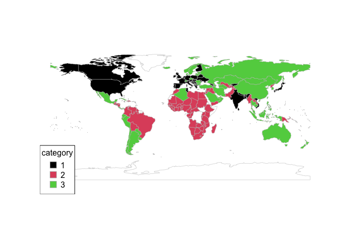

SIT114: Task 7.1P
================
Lyndon Purcell

------------------------------------------------------------------------

**Note to the reader:** Text displayed as `inline code` represents
packages, functions, logical values and indices. Text with a **bold**
emphasis symbolizes parameters for functions. Text written in *italics*
refers to arguments passed to parameters and variable names.

------------------------------------------------------------------------

This document demonstrates the use of *K*-means clustering algorithms.
The data used for this task will be from the Sustainable Society Indices
for the years 2016 and 2018. The datasets can be accessed
[here](https://ssi.wi.th-koeln.de/).

## Section 1: Load the data

First, we will read in the 2016 data using `read.csv`, specifying the
comment character used in the dataset. We will then drop all but four
columns; one which denotes the country, and three other variables. The
call to `head` returns the first six rows of our reduced dataset.

``` r
ssi <- read.csv("~/Desktop/Deakin/SIT114/Data/ssi_2016_categories.csv", comment.char="#")
ssi <- ssi[, c("Country", "PersonalDevelopmentAndHealth", "WellBalancedSociety", "Economy")]
head(ssi)
```

    ##     Country PersonalDevelopmentAndHealth WellBalancedSociety  Economy
    ## 1   Albania                     7.959609            6.992649 3.056494
    ## 2   Algeria                     7.336496            4.203906 6.154272
    ## 3    Angola                     5.692808            2.140138 3.753476
    ## 4 Argentina                     8.350592            3.895167 5.340636
    ## 5   Armenia                     7.420523            6.289224 3.829620
    ## 6 Australia                     8.590927            6.105539 7.593052

## Section 2: 3-means clustering algorithm

We will now create our clustering model, using the function `kmeans`. To
do so, we pass our data – minus the non-numeric column that contains the
country name – specify the value of **k** (3, in this case) and the
number of random starts we wish to use, so that our model does not get
stuck at a subpar local peak

The object list returned is then bound to *km_cluster*. As we are only
concerned with which cluster each country is assigned to, we can access
the *cluster* element of this list and then bind the result to the
variable *clusters*.

``` r
k <- 3
km_cluster <- kmeans(ssi[,-1], centers=k, nstart=10)
clusters <- km_cluster$cluster
```

## Section 3: Plotting the clusters on a map

Now that our countries have been assigned to 3 different clusters, based
on various societal markers, let us visualise the results.

The following code was not written by the author and, instead, was
provided as a part of the task guidelines for ease of visualisation. As
this code will be called a number of times, however, let’s encapsulate
it within a function for ease of reuse.

``` r
library("rworldmap")

plot_countries <- function(X, cluster_codes, num_k=3) {
  mapdata <- data.frame(Country=X[["Country"]], Cluster=cluster_codes) 
  mapdata <- joinCountryData2Map(mapdata, joinCode="NAME", nameJoinColumn="Country")
  mapCountryData(mapdata, nameColumnToPlot="Cluster", catMethod="categorical",
                 missingCountryCol="white", colourPalette=palette.colors(num_k, "R4"), 
                 mapTitle="")
}

plot_countries(ssi, clusters)
```

    * 153 codes from your data successfully matched countries in the map
    * 1 codes from your data failed to match with a country code in the map
    * 90 codes from the map weren't represented in your data

<!-- -->

The above is a graphical representation of the clusters generated based
on the indicators relating to personal development and health, the
economy, and how well balanced the society is.

## Section 4: Plotting all pairs of dimensions

The previous section helped us understand our clusters geographically
(and maybe geopolitically), but not statistically. To do so, let us plot
each variable in a pair-wise manner. This will help us gain some
intuition regarding the interplay between the variables and how they
influence the cluster partitions.

``` r
par(mar=c(0,0,0,0))
pairs(ssi[-1], col=clusters, pch=clusters, asp=1) 
legend("topleft", col=1:k, pch=1:k, legend=1:k, xpd=NA, bg="white")
```

<!-- -->

There are a few general patterns that we might infer from this.

Some variables show a correlation, and there is a fairly clean
transition from one cluster to the next as the value of the variables
rise (*PersonalDevelopmentAndHealth* and *WellBalancedSociety*, for
example).

Another pattern occurs when there is minimal correlation between the two
variables and the data-points are scattered widely. Here, there still
tends to be a relatively clean boundary between the clusters, only the
relationship is slightly more complex (as in *WellBalancedSociety* and
*Economy*). Cluster-X might be high (or low) in both variables A and B,
whereas Cluster-Y is high in A and low in B, whereas Cluster-Z is low in
A and high in B.

Many other valid descriptions of the plotted data could also be made.

## Section 5: Computing the averages of dimensions in each cluster

To get an idea where the centre of each cluster is, and the tendencies
of the countries that were assigned to each, we can look to the mean of
the dimensions considered.

The below code appends the cluster results to the *ssi* data-frame,
creates an empty *ave_dim* data-frame to hold the results of the
calculations, and then computes the arithmetic-mean of each dimension
for each cluster using the `apply` function inside a `for` loop.

The loop iterates through the clusters, using that as the method of
selecting the relevant observations, and then `apply` applies the `mean`
function column-wise. `rbind` then adds the results to the *ave_dim*
data-frame, which is then transposed and given meaningful row and column
names.

``` r
ssi <- cbind(ssi, KCluster=clusters)
ave_dim <- data.frame()
for (i in 1:3) {
  ave_dim <- rbind(ave_dim, apply(ssi[ssi$KCluster == i, 2:4], 2, mean))
}
ave_dim <- t(ave_dim)
rownames(ave_dim) <- c("P. Development & Health", "Well-Balanced Society", "Economy")
colnames(ave_dim) <- c("C1", "C2", "C3")
knitr::kable(ave_dim, digit=2)
```

|                         |   C1 |   C2 |   C3 |
|:------------------------|-----:|-----:|-----:|
| P. Development & Health | 7.93 | 6.32 | 7.81 |
| Well-Balanced Society   | 6.36 | 3.12 | 5.19 |
| Economy                 | 3.91 | 3.85 | 6.98 |

## Section 6: Hierachical clustering using average linkage

In this section, we will explore the data once more, only this time
using a different method for clustering the data into (three) groups.
The general method we will use is hierarchical clustering, which returns
a complete set of 1, ..., *n* clusters (where *n* is the number of
observations in the dataset). Hierarchical methods can be advantageous
in this regard because we do not need to specify *K* in advance.

We do, however, need to specify the method for merging clusters. This is
known as “linkage”. Common options for this are single, complete, and
average.

-   Single linkage involves merging the two clusters that have the
    closest two points; the most favourable “best case” scenario.

-   Complete linkage involves merging the two clusters that have the
    smallest distance between their two farthermost points; the most
    favourable “worst case” scenario.

-   Average linkage involves computing the pair-wise distance between
    all points in the alternate clusters, and merging the two clusters
    with the smallest average distance.

The code below implements hierarchical clustering using average linkage.

``` r
ssi_hclust <- hclust(dist(ssi[2:4]), method="average")
ssi$HCluster <- cutree(ssi_hclust, 3)
```

Let us plot these new clusters on the world map, to see if there are any
noticeable differences.

``` r
plot_countries(ssi, ssi$HCluster)
```

    * 153 codes from your data successfully matched countries in the map
    * 1 codes from your data failed to match with a country code in the map
    * 90 codes from the map weren't represented in your data

<!-- -->

It turns out, if you look closely, there are some minor differences
between the two. For example, the U.S. and India have been clustered
differently to what they were using *K*-means (moving from C1 to C3), as
well as Bolivia (moving from C3 to C2), among a few others.

Given that we have noted these differences, let us continue the
analysis, repeating the steps we undertook previously, to see if any
significant differences emerge.

First, the pair-wise comparison of the variables amongst the new
clusters.

``` r
par(mar=c(0,0,0,0))
pairs(ssi[2:4], col=ssi$HCluster, pch=ssi$HCluster, asp=1) 
legend("topleft", col=1:k, pch=1:k, legend=1:k, xpd=NA, bg="white")
```

<!-- -->

Here we see a similar interplay between the variables, though, the
location of a particular category may have shifted relative to the
others.

Next, the average of the variable dimensions for each cluster.

``` r
ave_dim_h <- data.frame()
for (i in 1:3) {
  ave_dim_h <- rbind(ave_dim_h, apply(ssi[ssi$HCluster == i, 2:4], 2, mean))
}
ave_dim_h <- t(ave_dim_h)
rownames(ave_dim_h) <- c("P. Development & Health", "Well-Balanced Society", "Economy")
colnames(ave_dim_h) <- c("C1", "C2", "C3")
knitr::kable(ave_dim_h, digit=2)
```

|                         |   C1 |   C2 |   C3 |
|:------------------------|-----:|-----:|-----:|
| P. Development & Health | 8.14 | 7.75 | 6.49 |
| Well-Balanced Society   | 7.00 | 4.87 | 3.59 |
| Economy                 | 4.18 | 6.86 | 3.66 |

For ease of comparison, let us print out the difference between the
variable means of the two clustering methods.

``` r
knitr::kable((ave_dim_h-ave_dim), digit=2)
```

|                         |   C1 |   C2 |    C3 |
|:------------------------|-----:|-----:|------:|
| P. Development & Health | 0.21 | 1.43 | -1.31 |
| Well-Balanced Society   | 0.64 | 1.75 | -1.60 |
| Economy                 | 0.27 | 3.01 | -3.32 |

We see here that the hierarchical clustering method selected countries
that were, on average, slightly better off in all variables to be in
*C1*, much better off to be in *C2*, and picked a more exclusively
poor-performing set of countries to make up *C3*.

## Section 7: Analysis of 2018 SSI data

As a final exploration of the SSI data, let us now quickly perform some
similar operations on the 2018 dataset to see if anything of relevance
comes up. To allow for this, the authors of the data were contacted and
a directly editable copy of the 2018 data was provided. For ease of use,
the categories section was copied into another file, which was then
saved using the extension csv.

This file is then read in using the following code.

``` r
ssi_18 <- read.csv("~/Desktop/Deakin/SIT114/Data/ssi_2018_categories.csv", skip=2)
colnames(ssi_18)
```

    ## [1] "Country"                      "Basic.Needs"                 
    ## [3] "Personal.Developm.....Health" "Well.balanced.Society"       
    ## [5] "Natural.Resources"            "Climate...Energy"            
    ## [7] "Transition"                   "Economy"

We will then further reduce our dataset to better resemble what we were
working with for the 2016 data. To do this, we will once more drop all
columns except the country name and the three variables we have been
exploring thus far throughout the analysis. Using the corresponding
indexes to the columns above, we can do this as follows.

``` r
ssi_18 <- ssi_18[, c(1, 3, 4, 8)]
```

Next, we will clean up the data, just a fraction. First, we will remove
observations that have missing values for the columns of interest using
`na.omit`. We will also rename the columns so that they appear as the
2016 data did, for sake of consistency.

``` r
ssi_18 <- na.omit(ssi_18)
colnames(ssi_18)<-c("Country","PersonalDevelopmentAndHealth","WellBalancedSociety","Economy")
head(ssi_18)
```

    ##               Country PersonalDevelopmentAndHealth WellBalancedSociety Economy
    ## 1         Afghanistan                          8.0                 1.6     3.5
    ## 2             Albania                          9.0                 6.7     3.6
    ## 3             Algeria                          8.0                 3.3     5.5
    ## 6              Angola                          6.9                 2.8     2.6
    ## 7 Antigua and Barbuda                          9.8                 5.9     2.8
    ## 8           Argentina                          8.5                 5.8     3.3

Using this new data, we will now perform a cluster to determine if the
indicators have changed between the two datasets sufficiently to result
in differences detectable by *K*-means.

``` r
km_18 <- kmeans(ssi_18[,-1], centers=k, nstart=10)
cluster_18 <- km_18$cluster
```

And once more plot our data.

``` r
plot_countries(ssi_18, cluster_18)
```

    * 191 codes from your data successfully matched countries in the map
    * 6 codes from your data failed to match with a country code in the map
    * 52 codes from the map weren't represented in your data

<!-- -->

This visualisation demonstrates some easily detectable changes in the
way the countries are clustered compared to the 2016 data. For example,
in 2016 using 3-means, the continent of Africa was clustered with Brazil
and some other countries in South America. When using hierarchical
clustering for the same year, the United States was also in this cluster
along with India.

When using 3-means on the 2018 data, however, Africa appears to dominate
a class all on its own (with a sprinkling of a few other countries from
the the Middle East, Asia and Oceania).

As a final exploration, we will perform a hierarchical cluster,
“cutting” the tree at the point of 5 branches. With slightly more
granular clusters, we may be able to see some separation of countries
that have been classified consistently by all methods so far (such as
most of Asia).

``` r
hclust_18 <- hclust(dist(ssi_18[2:4]), method="average")
ssi_18$HCluster <- cutree(hclust_18, 5)
```

Again, we will plot these clusters to the world map, to see if there are
any noticeable differences.

``` r
plot_countries(ssi_18, ssi_18$HCluster, num_k=5)
```

    * 191 codes from your data successfully matched countries in the map
    * 6 codes from your data failed to match with a country code in the map
    * 52 codes from the map weren't represented in your data

<!-- -->

Intuitively, it seems that this approach is insufficient for drawing out
much more information than the 3-means method. One way to see this
numerically is by calling `table` on the clusters. Which demonstrates
that only 13 countries were classed in the two “newly available”
clusters.

``` r
table(ssi_18$HCluster)
```

    ## 
    ##  1  2  3  4  5 
    ## 62 48 74  8  5

We need not take this results pessimistically, however, as it indicates
that there are consistent results between our *K*-means and hierarchical
clustering approaches. This can be as valuable to discover as finding
new patterns or ways of sectioning up the data.
